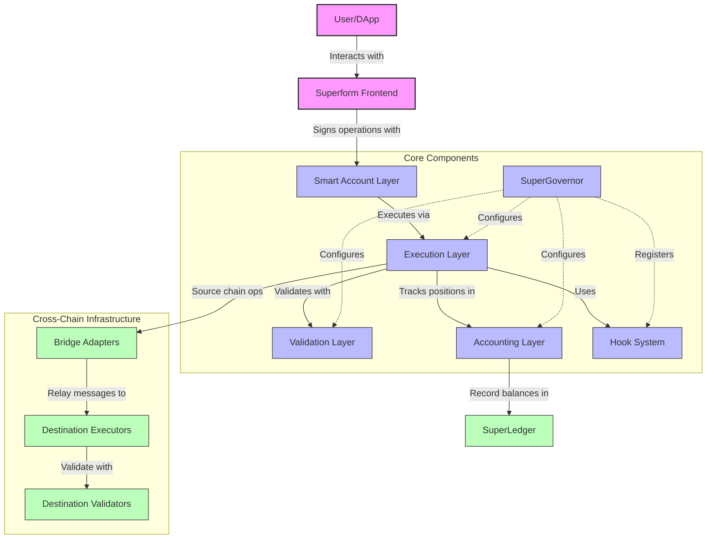
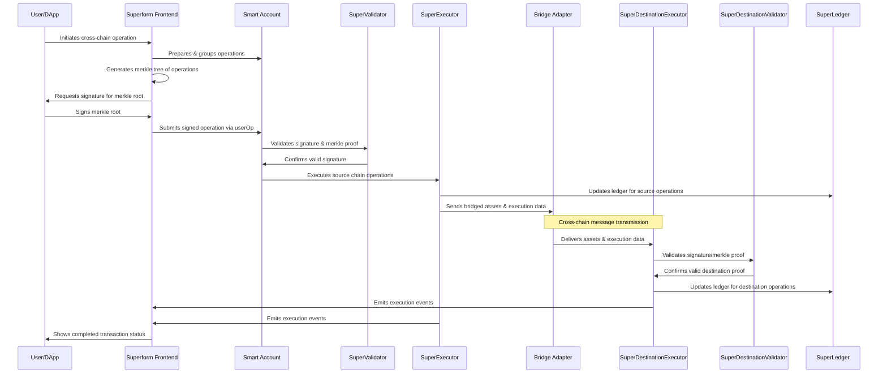

[](https://codecov.io/gh/superform-xyz/v2-core)

# Overview

Superform v2 is a modular DeFi protocol for yield abstraction that allows dynamic execution and flexible composition of user operations via ERC7579 modules. 

This document provides technical details, reasoning behind design choices, and discussion of potential edge cases and risks in Superform's v2 contracts. 

The protocol consists of the following components:

- **Core Contracts**: The primary business logic, interfaces, execution routines, accounting mechanisms, and validation components

## Repository Structure

```
core/                   # Core protocol contracts
├── accounting/         # Accounting logic
├── adapters/           # Bridge implementations
├── executors/          # Execution logic contracts
├── hooks/              # Protocol hooks
├── interfaces/         # Contract interfaces
├── libraries/          # Shared libraries
├── paymaster/          # Native paymaster
└── validators/         # Validation contract
src/
└── vendor/             # Vendor contracts (NOT IN SCOPE)
```

## Superform Core Key Components

The following diagram illustrates how users interact directly with the core system and how the different components work together. 



### User Interaction Flow

Smart accounts that interact with Superform must install four essential ERC7579 modules:

- SuperExecutor / SuperDestinationExecutor: Installs hooks and executes operations.
- SuperValidator / SuperDestinationValidator: Validates userOps against a Merkle root.



### Execution Layer

#### Hooks

Hooks are lightweight, modular contracts that perform specific operations (e.g., token approvals, transfers) during an execution flow. Hooks are designed to be composable and can be chained together to create complex transaction flows. If any hook fails, the entire transaction is reverted, ensuring atomicity.

#### SuperExecutor and SuperDestinationExecutor

SuperExecutor is the standard executor that sequentially processes one or more hooks on the same chain. It manages transient state storage for intermediate results, performs fee calculations, and interacts with the SuperLedger for accounting. It is responsible for executing the provided hooks, invoking pre- and post-execute functions to handle transient state updates and ensuring that the operation's logic is correctly sequenced.

SuperDestinationExecutor is a specialized executor for handling cross-chain operations on destination chains. It processes bridged executions, handles account creation, validates signatures, and forwards execution to the target accounts.

#### Transient Storage Mechanism

Transient storage is used during the execution of a SuperExecutor transaction to temporarily hold state changes. This
mechanism allows efficient inter-hook communication without incurring high gas costs associated with permanent storage
writes.

### Validation Layer

SuperValidatorBase is the base contract providing core validation functionality used across all validator implementations, including signature validation and account ownership verification.

#### SuperValidator and SuperDestinationValidator

SuperValidator and SuperDestinationValidator are used to validate operations through Merkle proof verification, ensuring only authorized operations are executed. They leverage a single owner signature over a Merkle root representing a batch of operations.

SuperValidator:
- Role: A validator contract for ERC4337 entrypoint actions. It enables users to sign once for multiple user operations using merkle proofs, enhancing the chain abstraction experience.
- Usage: Designed for standard ERC-4337 `EntryPoint` interactions. Validates `UserOperation` hashes (`userOpHash`) provided within a Merkle proof, typically constructed by the SuperBundler. Implements `validateUserOp` and EIP-1271 `isValidSignatureWithSender`.

SuperDestinationValidator:
- Role: Validates cross-chain operation signatures for destination chain operations. It verifies merkle proofs and signatures to ensure only authorized operations are executed.
- Usage: Specifically designed for validating operations executed *directly* on a destination chain via `SuperDestinationExecutor`, bypassing the ERC-4337 `EntryPoint`. Implements a custom `isValidDestinationSignature` method; `validateUserOp` and `isValidSignatureWithSender` are explicitly **not** implemented and will revert.
- Merkle Leaf Contents: `keccak256(keccak256(abi.encode(callData, chainId, sender, executor, dstTokens[], intentAmounts[], validUntil, validatorAddress)))`. The leaf commits to the full context of the destination execution parameters.
- Replay Protection:
    - Includes `block.chainid` in the leaf and verifies it during signature validation to prevent cross-chain replay.
    - Incorporates a `validUntil` timestamp in the leaf, checked against `block.timestamp`.
    - Includes the `executor` address in the leaf to prevent replay across different executor modules installed on the same account.
    - Includes the `validator` address in the leaf to prevent replay across different validator modules installed on the same account.
    - Uses a unique namespace (`SuperValidator`) in the final signed message hash.
- Notes:
    - The destination account must use the same signer as the source account. If the validator is uninstalled and then reinstalled with a different configuration, the flow will no longer function correctly.
    - Execution occurs only if the account holds a balance greater than the corresponding intentAmounts[] for each token in dstTokens[].

### Accounting Layer

#### SuperLedger

Handles accounting aspects (pricing, fees) for both INFLOW and OUTFLOW operations. Tracks cost basis and calculates performance fees on yield. It ensures accurate pricing and accounting for INFLOW and OUTFLOW type hooks.

#### YieldSourceOracles

The system uses a dedicated on-chain oracle system to compute the price per share for accounting. Specialized oracles exist for different vault standards (ERC4626, ERC5115, ERC7540, etc.) that provide accurate price data and TVL information.

### Infrastructure

#### SuperBundler

A specialized off-chain bundler that processes ERC-4337 UserOperations on a timed basis. It integrates with the validation system to ensure secure and compliant operation.
Unlike typical bundlers that immediately forward userOps to the EntryPoint, SuperBundler collects them, simulates them in advance, and dispatches them in timed batches — allowing for gas optimization, sequencing control, and higher throughput.

⚠️ Note: According to ERC-4337 recommendations, bundler operates using a private RPC endpoint. All UserOperations are simulated before submission to ensure validity and avoid wasting gas on failing transactions.

Bundler Operation

- Allows fee charging in ERC20 tokens with a fee payment hook (a transfer hook), which transfers fees to the
  SuperBundler so that it can orchestrate the entire operation.
- Allows for a single signature experience flow, where the SuperBundler builds a merkle tree of all userOps that are
  going to be executed in all chains for a given user intent. This signature is validated in SuperMerkle Validator.
- Allows for delayed execution of userOps (async userOps) with a single user signature. UserOps are processed when and
  where required rather than immediately upon receipt. Reasonable deadlines apply here. Typical desired flow of usage is
  for example with asynchronous vaults like those following ERC7540 standard.
- Centralization Concerns:
  - Since SuperBundler controls both the userOp and validation flow, it introduces a degree of centralization. We
    acknowledge that this could be flagged by auditors.
  - In later stages this system is planned to be decentralized.
- Mitigation: Transparency around this design choice and the availability of fallback mechanisms when operations are not
  executed through SuperBundler.

#### Adapters

Adapters are a set of gateway contracts that handle the acceptance of relayed messages and trigger execution on destination chains via 7579 SuperDestinationExecutor.

#### SuperNativePaymaster

SuperNativePaymaster is a specialized paymaster contract that wraps around the ERC4337 EntryPoint. It enables users to pay for operations using ERC20 tokens from any chain, on demand. It's primarily used by SuperBundler for gas sponsoring. This functionality is necessary because of the SuperBundler's unique fee collection mechanism where userOps are executed on user behalf and when required.

#### SuperRegistry

Provides centralized address management for configuration and upgradeability.

## Development Setup

### Prerequisites

- Foundry
- Node.js
- Git

### Installation

Clone the repository with submodules:

```bash
git clone --recursive https://github.com/superform-xyz/v2-core
cd v2-core
```

Install dependencies:

```bash
forge install
```

```bash
cd lib/modulekit
pnpm install
cd ../..
cd lib/safe7579
pnpm install
cd ../..
cd lib/nexus
yarn
cd ../..
```

Note: This requires pnpm and will not work with npm. Install it using:

```bash
curl -fsSL https://get.pnpm.io/install.sh | sh -
```

Copy the environment file:

```bash
cp .env.example .env
```

### Building & Testing

Build:

```bash
forge build
```

Supply your node rpc directly in the makefile and then

```bash
make ftest
```