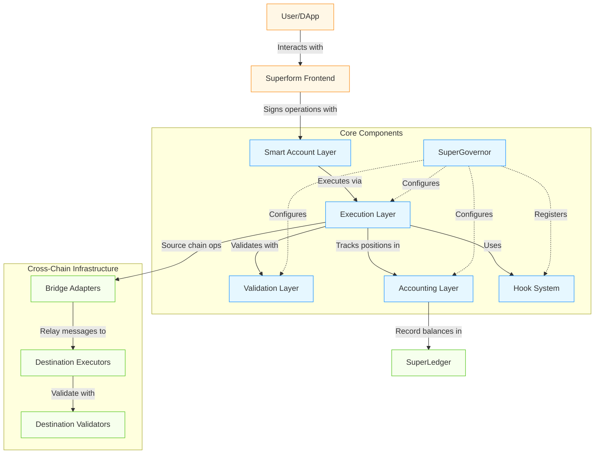
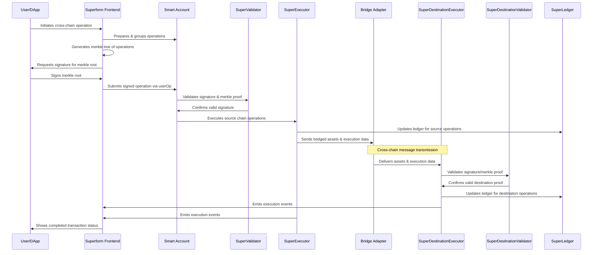

[](https://codecov.io/gh/superform-xyz/v2-core)
[](https://opensource.org/licenses/Apache-2.0)

# Overview

Superform v2 Core is a modular DeFi protocol for yield abstraction that allows dynamic execution and flexible composition of user operations via ERC7579 modules. 

Core consists of the following components:

- **Execution Layer**: ERC7579 executors (SuperExecutor, SuperDestinationExecutor) that process hook bundles with transient storage for gas-efficient inter-hook communication.
- **Validation Layer**: Merkle-proof validators (SuperValidator, SuperDestinationValidator) enabling single-signature authorization for batched multi-chain operations.
- **Accounting Layer**: SuperLedger and YieldSourceOracles for trustless cost basis tracking and performance fee calculation across vault standards (ERC4626, ERC5115, ERC7540, Pendle).
- **Infrastructure**: Bridge adapters for cross-chain messaging, SuperNativePaymaster for ERC20 gas sponsorship, and SuperBundler for batched UserOperation processing.

📚 [Documentation](https://docs.superform.xyz/) | 🔒 [Audits](https://github.com/superform-xyz/v2-core/tree/dev/audits)

## Repository Structure

```
src/
│   ├── core/
│   │   ├── accounting/     # SuperLedger and yield source oracles
│   │   ├── adapters/       # Bridge adapter implementations
│   │   ├── executors/      # SuperExecutor and SuperDestinationExecutor
│   │   ├── hooks/          # Composable protocol hooks
│   │   ├── interfaces/     # Core interface definitions
│   │   ├── libraries/      # Shared utility libraries
│   │   ├── paymaster/      # SuperNativePaymaster
│   │   └── validators/     # SuperValidator and SuperDestinationValidator
└── vendor/                 # Third-party contracts
```

## Superform Core Key Components

The following diagram illustrates how users interact directly with the core system and how the different components work together. 


```mermaid
graph TD
    User[User/DApp] -->|Interacts with| Frontend[Superform Frontend]
    Frontend -->|Signs operations with| SmartAccount[Smart Account Layer]
    
    subgraph "Core Components"
        SmartAccount -->|Executes via| Executors[Execution Layer]
        Executors -->|Validates with| Validators[Validation Layer]
        Executors -->|Tracks positions in| Accounting[Accounting Layer]
        Executors -->|Uses| Hooks[Hook System]
        
        Registry[SuperGovernor] -.->|Configures| Executors
        Registry -.->|Configures| Validators
        Registry -.->|Configures| Accounting
        Registry -.->|Registers| Hooks
    end
    
    subgraph "Cross-Chain Infrastructure"
        Executors -->|Source chain ops| Bridges[Bridge Adapters]
        Bridges -->|Relay messages to| DestExecutors[Destination Executors]
        DestExecutors -->|Validate with| DestValidators[Destination Validators]
    end
    
    Accounting -->|Record balances in| Ledgers[SuperLedger]

    classDef user fill:#fff7e6,stroke:#fa8c16
    classDef core fill:#e6f7ff,stroke:#1890ff
    classDef infra fill:#f6ffed,stroke:#52c41a
    
    class User,Frontend user
    class SmartAccount,Executors,Validators,Accounting,Hooks,Registry core
    class Bridges,DestExecutors,DestValidators,Ledgers infra
```

### User Interaction Flow

Smart accounts that interact with Superform must install four essential ERC7579 modules:

- **SuperExecutor / SuperDestinationExecutor**: Installs hooks and executes operations.
- **SuperValidator / SuperDestinationValidator**: Validates userOps against a Merkle root.


```mermaid
sequenceDiagram
    participant User as User/DApp
    participant Frontend as Superform Frontend
    participant SmartAccount as Smart Account
    participant SuperMerkle as SuperValidator
    participant SuperExecutor as SuperExecutor
    participant Bridge as Bridge Adapter
    participant DestExecutor as SuperDestinationExecutor
    participant DestValidator as SuperDestinationValidator
    participant Accounting as SuperLedger

    User->>Frontend: Initiates cross-chain operation
    Frontend->>SmartAccount: Prepares & groups operations
    Frontend->>Frontend: Generates merkle tree of operations
    Frontend->>User: Requests signature for merkle root
    User->>Frontend: Signs merkle root
    
    Frontend->>SmartAccount: Submits signed operation via userOp
    SmartAccount->>SuperMerkle: Validates signature & merkle proof
    SuperMerkle->>SmartAccount: Confirms valid signature
    
    SmartAccount->>SuperExecutor: Executes source chain operations
    SuperExecutor->>Accounting: Updates ledger for source operations
    SuperExecutor->>Bridge: Sends bridged assets & execution data
    
    Note over Bridge,DestExecutor: Cross-chain message transmission
    
    Bridge->>DestExecutor: Delivers assets & execution data
    DestExecutor->>DestValidator: Validates signature/merkle proof
    DestValidator->>DestExecutor: Confirms valid destination proof
    DestExecutor->>Accounting: Updates ledger for destination operations
    
    DestExecutor->>Frontend: Emits execution events
    SuperExecutor->>Frontend: Emits execution events
    Frontend->>User: Shows completed transaction status
```

### Execution Layer

#### Hooks

Hooks are lightweight, modular contracts that perform specific operations (e.g., token approvals, transfers) during an execution flow. Hooks are designed to be composable and can be chained together to create complex transaction flows. If any hook fails, the entire transaction is reverted, ensuring atomicity.

#### SuperExecutor and SuperDestinationExecutor

SuperExecutor is the standard executor that sequentially processes one or more hooks on the same chain. It manages transient state storage for intermediate results, performs fee calculations, and interacts with the SuperLedger for accounting. It is responsible for executing the provided hooks, invoking pre- and post-execute functions to handle transient state updates and ensuring that the operation's logic is correctly sequenced.

SuperDestinationExecutor is a specialized executor for handling cross-chain operations on destination chains. It processes bridged executions, handles account creation, validates signatures, and forwards execution to the target accounts.

#### Transient Storage Mechanism

Transient storage is used during the execution of a SuperExecutor transaction to temporarily hold state changes. This
mechanism allows efficient inter-hook communication without incurring high gas costs associated with permanent storage
writes.

### Validation Layer

SuperValidatorBase is the base contract providing core validation functionality used across all validator implementations, including signature validation and account ownership verification.

#### SuperValidator and SuperDestinationValidator

SuperValidator and SuperDestinationValidator are used to validate operations through Merkle proof verification, ensuring only authorized operations are executed. They leverage a single owner signature over a Merkle root representing a batch of operations.

SuperValidator enables users to sign once for multiple user operations using merkle proofs, enhancing the chain abstraction experience and SuperDestinationValidator validates cross-chain operation signatures for destination chain operations. 

### Accounting Layer

#### SuperLedger

Handles accounting aspects (pricing, fees) for both INFLOW and OUTFLOW operations. Tracks cost basis and calculates performance fees on yield. It ensures accurate pricing and accounting for INFLOW and OUTFLOW type hooks.

#### YieldSourceOracles

The system uses a dedicated on-chain oracle system to compute the price per share for accounting. Specialized oracles exist for different vault standards (ERC4626, ERC5115, ERC7540, etc.) that provide accurate price data and TVL information.

### Infrastructure

#### SuperBundler

A specialized off-chain bundler that processes ERC-4337 UserOperations on a timed basis. It integrates with the validation system to ensure secure and compliant operation.
Unlike typical bundlers that immediately forward userOps to the EntryPoint, SuperBundler collects them, simulates them in advance, and dispatches them in timed batches — allowing for gas optimization, sequencing control, and higher throughput.

#### Adapters

Adapters are a set of gateway contracts that handle the acceptance of relayed messages and trigger execution on destination chains via 7579 SuperDestinationExecutor.

#### SuperNativePaymaster

SuperNativePaymaster is a specialized paymaster contract that wraps around the ERC4337 EntryPoint. It enables users to pay for operations using ERC20 tokens from any chain, on demand. It's primarily used by SuperBundler for gas sponsoring. This functionality is necessary because of the SuperBundler's unique fee collection mechanism where userOps are executed on user behalf and when required.

#### SuperRegistry

Provides centralized address management for configuration and upgradeability.

## Development Setup

### Prerequisites

- Foundry
- Node.js
- Git

### Installation

Clone the repository with submodules:

```bash
git clone --recursive https://github.com/superform-xyz/v2-core
cd v2-core
```

Install dependencies:

```bash
forge install
```

```bash
cd lib/modulekit/
pnpm i
```

```bash
cd lib/safe7579
pnpm i
```

```bash
cd lib/nexus
yarn
```

Note: This requires pnpm and will not work with npm. Install it using:

```bash
curl -fsSL https://get.pnpm.io/install.sh | sh -
```

Copy the environment file:

```bash
cp .env.example .env
```

### Building & Testing

Build:

```bash
forge build
```

Supply your node rpc directly in the makefile and then

```bash
make ftest
```
