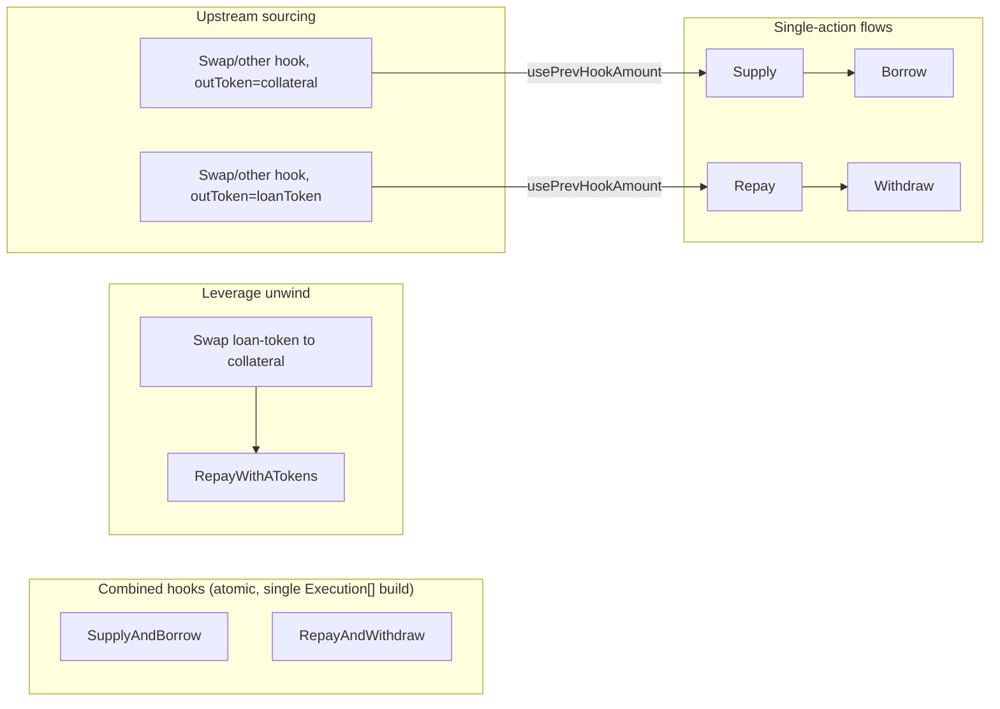

# Aave V3 Hook Suite — Flow Analysis & Gap Report

Scope: `BaseAaveV3LoanHook` + `AaveV3{Supply,Withdraw,Borrow,Repay,SupplyAndBorrow,RepayAndWithdraw,RepayWithATokens}Hook`,
as planned in `interview-notes.md` and researched in `best-practices.md`, `framework-docs.md`,
`repo-analysis.md`, `evm-security.md`. This document treats each hook as a step in a "flow" (a
sequence of `Execution[]` a smart account runs) and analyzes chaining behavior, edge/error states,
test coverage, and open acceptance-criteria decisions the four source documents leave unresolved.

No code exists yet (greenfield, per `repo-analysis.md` §0). This is a pre-implementation gap
review — findings should be resolved (or explicitly deferred) before `superform-hook-master` turns
`repo-analysis.md`'s design into code.

---

## 1. Flow Overview

### 1.1 Hook execution model (recap)
A hook is a pure `_buildHookExecutions(prevHook, account, data) -> Execution[]` builder. The
account runs the returned executions itself. `usePrevHookAmount` lets a hook pull the prior hook's
`getOutAmount()`/`getOutToken()` from transient storage instead of a literal calldata amount —
this is the mechanism that turns single hooks into multi-step flows (e.g., swap → supply → borrow).

### 1.2 Canonical flows this suite must support

Two structurally different chaining mechanisms exist and the docs conflate them:
1. **Intra-hook chaining** inside `SupplyAndBorrow` / `RepayAndWithdraw` — the second leg's amount
   (`borrowAmount`, `withdrawAmount`) is a **fixed calldata value**, never derived from the first
   leg's result.
2. **Inter-hook chaining** via `usePrevHookAmount` — a *separate* hook reads the previous hook's
   `getOutAmount()`. This is the only place a genuinely dynamic amount crosses a hook boundary.

None of the four docs draws this distinction explicitly, which is the root of several gaps below.

---

## 2. Hook-Chaining Flow Gaps

### 2.1 `usePrevHookAmount` has no token-identity check (highest-signal chaining gap) — CONFIRMED against V4 source
Verified directly: `AaveV4SupplyHook.sol:63` and `AaveV4BorrowHook.sol:62` both do
`vars.amount = ISuperHookResult(prevHook).getOutAmount(account);` with **no accompanying
`getOutToken()` check anywhere in either file** (confirmed via grep across
`src/hooks/loan/aave-v4/{AaveV4SupplyHook,AaveV4BorrowHook,BaseAaveV4LoanHook}.sol`). This is not
an inference from `repo-analysis.md`'s prose — it's the actual, existing V4 behavior the V3 suite is
instructed to mirror, so the gap will be inherited by construction unless explicitly fixed.
Concretely:

- **Valid flow**: Swap hook outputs `collateralToken`, amount X → `AaveV3SupplyHook` (expects
  collateral) pulls X. Correct.
- **Silent-wrong-amount flow**: Swap hook outputs `USDC` (loan token), amount X →
  `AaveV3SupplyHook` for `WETH` collateral pulls X anyway and calls
  `supply(WETH, X, account, 0)`. If the account happens to hold ≥ X wei of WETH from an unrelated
  source, this **succeeds silently with a nonsensical amount** (X was priced as USDC units, not
  WETH). If it doesn't hold enough, it reverts on transfer — a safer but still confusing failure.
- Same issue for `AaveV3BorrowHook`/`AaveV3WithdrawHook` chained after a `Supply`/`Repay` hook: the
  prior hook's `outToken` is the *collateral* token, but `Borrow`/`Withdraw`'s "amount" is
  denominated in the *loan* or a *different* collateral reserve. Chaining `Supply → Borrow` as two
  independent hooks (as opposed to using `SupplyAndBorrowHook`) is a plausible bundler mistake this
  suite currently cannot catch.

**Recommendation**: either (a) add an explicit `outToken == expectedToken` assertion in every
`_buildHookExecutions` that resolves `usePrevHookAmount`, reverting with a new custom error
(e.g., `PREV_HOOK_TOKEN_MISMATCH()`), or (b) if V4 doesn't do this either (worth confirming against
`AaveV4SupplyHook`/`AaveV4BorrowHook` directly, since `repo-analysis.md` didn't check this), at
minimum document which hook chains are semantically valid and add negative fork tests proving the
"wrong token, sufficient balance" case does NOT get silently accepted.

### 2.2 `SupplyAndBorrow`'s `borrowAmount` is decoupled from the (possibly dynamic) supply amount
`repo-analysis.md` §1.6/9 confirms `borrowAmount` is a fixed calldata value ("computed off-chain by
bundler ... on-chain derivation impractical"), while `amount` (the supply leg) can come from
`usePrevHookAmount` (e.g., swap output with slippage). This means:
- If the actual supplied amount comes in **lower** than the bundler quoted (slippage, fee-on-transfer
  collateral, partial fill), the fixed `borrowAmount` may now represent a **higher effective LTV**
  than intended, and `borrow` may revert with `COLLATERAL_CANNOT_COVER_NEW_BORROW` /
  `HEALTH_FACTOR_LOWER_THAN_LIQUIDATION_THRESHOLD` — or worse, **succeed** but leave a much riskier
  position than the user signed off on, because Aave's revert is a hard floor (HF ≥ 1), not the
  user's intended safety margin.
- If the supplied amount comes in **higher**, the position is simply under-levered — a silent economic
  outcome, not a revert, so it's easy to miss in testing.
- **Gap**: no documented tolerance/guard (e.g., a max-deviation check, or explicitly disallowing
  `usePrevHookAmount` upstream of `SupplyAndBorrow`'s supply leg). Needs an explicit acceptance
  criterion: is `usePrevHookAmount` even a supported input to `SupplyAndBorrowHook`, or should the
  combined hook require a literal `amount` precisely because `borrowAmount` can't adapt? This
  contradicts `repo-analysis.md`'s layout, which keeps `usePrevHookAmount` as a general base-level
  flag applying uniformly to all hooks including the combined ones.

### 2.3 `RepayAndWithdraw`'s `withdrawAmount` vs. partial-repay dust
Same class of bug as 2.2 in the opposite direction: if the repay leg is **partial** (not
`isFullRepayment`) and sourced via `usePrevHookAmount`, a fixed `withdrawAmount` calldata value
that assumes the debt is now fully closed will either (a) revert on the health-factor check if debt
remains and withdrawal would be unsafe, or (b) succeed but leave the position under-collateralized
relative to what the signer intended. No test scenario in `evm-security.md` §6 exercises "partial
repay via `usePrevHookAmount` + fixed downstream withdraw."

### 2.4 `AaveV3RepayWithATokensHook`'s outAmount/outToken semantics are unresolved
`repo-analysis.md` §9 literally hedges: *"`_pre/_post`: measure the **aToken** balance consumed, OR
keep it simple and set outToken=loanToken with debt-reduction semantics; simplest is to snapshot
loan-token debt via the account's aToken balance diff."* This is presented as an open choice, not a
decision. It matters for chaining because:
- If a hook downstream expects `getOutToken() == loanToken` with an underlying-denominated amount
  (consistent with `AaveV3RepayHook`), but `RepayWithATokensHook` actually measures aToken (a
  different, though 1:1-pegged, contract address) balance delta, `getOutToken()` returning the
  aToken address would break the (currently nonexistent, see 2.1) token-match assumption other
  hooks might add.
- **Gap**: this must be pinned down as a concrete decision before implementation — recommend
  `outToken = loanToken` (the underlying), `outAmount = debt burned` (== aToken burned, since 1
  aToken tracks 1 unit of underlying-equivalent debt at time of burn), for consistency with
  `AaveV3RepayHook`'s semantics and to keep downstream chaining (e.g., "repaid X, now do something
  with X") intuitive.

### 2.5 `repayWithATokens(max)` can silently partial-repay — a genuinely new "unhandled state"
`best-practices.md` and `framework-docs.md` both describe `repayWithATokens(asset, max, 2)` as
"cleans up residual dust," implying full closure. But Aave's actual behavior is
**`repay = min(currentDebt, callerATokenBalance)`** — if the account's aToken balance is *less*
than its debt (e.g., partial collateral already withdrawn, or debt inflated by unfavorable
interest-rate divergence from collateral yield), `max` **silently repays only what aTokens are
available and leaves residual debt outstanding, without reverting**. None of the four docs states
this distinction or tests it. This is materially different from `repay(max)`'s guarantee ("repay the
whole debt") and is a real trap for anyone assuming `RepayWithATokensHook(isFullRepayment=true)`
guarantees debt == 0 afterward — e.g., a bundler that chains
`RepayWithATokensHook(max) → WithdrawHook(max)` assuming the position is closed could hit a
health-factor revert on the withdraw, or — if HF still permits some withdrawal — successfully
withdraw *some* collateral while debt remains open, which is not "closing the position" as intended.
**Needs**: explicit doc note + a fork test with aTokenBalance < debt asserting partial-repay,
non-revert, and downstream-withdraw-of-remaining-collateral behavior.

### 2.6 No `prevHook == address(0)` / "first hook with usePrevHookAmount=true" test called out
Implicit in the base (`getOutAmount(address(0))` reads empty transient storage → 0 → revert
`AMOUNT_NOT_VALID`), but not listed as an explicit test case anywhere. Cheap to add, worth stating
as a required unit test per hook (mirrors V4 pattern presumably, but not confirmed).

---

## 3. Aave V3 Edge/Error States — Coverage Gaps

Most of the requested edge states (isolation mode, siloed borrowing, frozen/paused, caps, 0%-LTV,
e-mode, max semantics) are already *documented* in `best-practices.md` §3 and `evm-security.md`
§2.2–2.7 with a "cannot pre-validate, let Aave revert, cover with fork tests" posture. The gaps
below are about **what's still missing even under that posture**.

### 3.1 L2 sequencer-downtime oracle sentinel — completely unaddressed, MVP-relevant
`framework-docs.md` §4 lists `PRICE_ORACLE_SENTINEL_CHECK_FAILED (49)` as a documented `borrow()`
revert condition and then **never mentions it again** — not in `best-practices.md`, not in
`evm-security.md`'s risk map or testing plan, not in `interview-notes.md`. This is a real gap
because the MVP chain list explicitly includes **Arbitrum and Optimism**, both L2s where Aave wires
a `PriceOracleSentinel` around Chainlink's sequencer-uptime feed: if the sequencer is down or within
its grace period after coming back up, `borrow()` (and liquidation) can revert even though
collateral/HF are otherwise fine. This is chain-specific (does not affect Ethereum/Base/Polygon the
same way — Base and Polygon also have sequencers/considerations worth double-checking, but Arbitrum
and Optimism are the canonical cases). **Recommendation**: add this to `best-practices.md`/
`evm-security.md` as a documented revert, and add a fork test (or explicit "out of scope, Aave-owned"
note with a mocked-sentinel unit test) for `AaveV3BorrowHook` and `AaveV3SupplyAndBorrowHook` on
Arbitrum/Optimism.

### 3.2 Liquidation grace period (V3.1+ `liquidationGracePeriodUntil`) — unaddressed
`framework-docs.md` §4c lists `liquidationGracePeriodUntil` as a V3.1+ `ReserveData` field (internal
struct, not exposed via `getReserveData`) but no document discusses what user-facing operations it
restricts (this field gates certain actions on a reserve that recently had a bad-debt/insolvency
event). Not necessarily high-priority for the MVP chains/reserves chosen, but it's a real V3.1
mechanism with zero research coverage and zero test-plan mention. Recommend at minimum a one-line
"out of scope for MVP, Aave-enforced" note so it's a documented decision, not a blind spot.

### 3.3 `NOT_ENOUGH_AVAILABLE_USER_BALANCE` (pool liquidity, not health factor) — listed but not tested
`framework-docs.md` §4 lists this as a `withdraw()` revert (insufficient *pool* liquidity, distinct
from the health-factor revert). `evm-security.md` §6.2's edge-scenario list never includes a
"withdraw exceeds available pool liquidity (high utilization reserve)" case — only
supply/borrow-cap and frozen/paused. Since utilization-driven illiquidity is a realistic, frequent
mainnet condition (not a rare governance state like paused), it deserves its own fork-test entry,
ideally against a real high-utilization reserve at the pinned block.

### 3.4 The Supply hook's forced `setUserUseReserveAsCollateral(true)` call is an unresolved design decision with a real revert interaction
`repo-analysis.md` §9 (the V4→V3 mapping table) presents this as an open recommendation: *"keep it
in Supply for parity/safety, or drop it."* This is not a settled decision, and settling it wrong has
a concrete failure mode documented independently in `best-practices.md` §1
(`setUserUseReserveAsCollateral` "Reverts if ... the asset has 0% LTV (cannot be enabled)"):
- If `AaveV3SupplyHook` **unconditionally** calls `setUserUseReserveAsCollateral(asset, true)` on
  every supply (not just the first), then **every single supply of a 0%-LTV reserve via this hook
  reverts** — even when the user only wants lending yield and never intends to use the asset as
  collateral. This turns an Aave-safe no-op (auto-enable silently skipped) into a hard hook-level
  failure for an entire class of reserves.
- It also interacts with isolation mode: a user who already holds an isolated asset as collateral
  and intentionally supplies a *second* asset without enabling it as collateral (to avoid the
  "only one collateral while isolated" conflict) would have that choice overridden by the hook,
  producing a revert on `setUserUseReserveAsCollateral(true)` instead of a clean supply-only op.
- **Gap / recommendation**: make the collateral-enable call optional — either drop it entirely
  (rely on Aave's auto-enable, matching the interview's stated MVP posture: "no dedicated toggle
  hook... rely on Aave auto-enable") or gate it behind an explicit calldata boolean
  (`enableAsCollateral`). This must be decided before implementation; it is currently the single
  highest-impact open design question in the whole suite, because it can make otherwise-valid
  supply operations unconditionally revert for a real (if less common) class of reserves.

### 3.5 `interestRateMode`: interview decision conflicts with the security research's recommendation
`interview-notes.md` decides: *"Configurable byte in hook data ... per-call selectable to remain
forward/backward compatible."* `best-practices.md` §2 and `evm-security.md` §2.1/§4.8 both argue
strongly for hardcoding `2` or, at minimum, validating `== 2` with a custom error rather than
forwarding an arbitrary byte. Neither `interview-notes.md` nor `repo-analysis.md`'s proposed layout
(§8) states **where** that validation happens (base decoder vs. each hook vs. not at all — "let Aave
revert"), nor names a custom error. This is an unresolved conflict between two of the four source
documents, not merely a missing detail, and should be explicitly re-decided (not silently defaulted
during implementation) given the security research is unambiguous that forwarding raw bytes 0/1/3+
is a foot-gun. Recommend: keep the byte in calldata for forward-compat as interview-notes wants, but
add hook-level validation (`revert UnsupportedInterestRateMode()` for anything != 2) so failures are
legible instead of an opaque Aave error code.

### 3.6 e-mode interaction is untested in both directions
Covered as "hooks should not silently change e-mode" (correct, no e-mode hook is in scope), but
missing: a fork test where the account is **already** in an e-mode category (set independently,
outside this hook suite) before calling `AaveV3Supply`/`AaveV3Borrow`/`AaveV3SupplyAndBorrow`.
E-mode changes effective LTV/liquidation threshold, so the "collateral cannot cover new borrow"
boundary shifts — worth at least one regression fork test confirming the hooks behave correctly
(no hidden assumptions about non-e-mode LTV) when e-mode is externally active.

### 3.7 Frozen/paused/cap tests scoped only to single-action hooks
`evm-security.md` §6.2 lists frozen/paused/cap scenarios but the concrete assertions ("supply/borrow
revert, repay/withdraw allowed on frozen") are framed around individual hooks. Neither doc explicitly
extends this matrix to `SupplyAndBorrowHook` (does a frozen borrow-side reserve revert the whole
combined execution, leaving the supply leg's approve un-reset since it never reaches the trailing
`approve(pool,0)`? — worth confirming the ordering doesn't leave dangling approvals *even on revert*,
though revert unwinds all state so this is likely moot, but should be an explicit test, not an
assumption) or `RepayAndWithdrawHook` (repay succeeds, then withdraw fails on a differently-paused
collateral reserve — is that combination tested?).

### 3.8 "Full-repay dust" scenario is described but never actually tested end-to-end across time
Every doc repeats "interest accrues between quote and execution" as the core justification for
`type(uint256).max`. But `evm-security.md` §6.1's fork-test list executes supply → borrow → repay →
withdraw as a same-block (or same-test, effectively same-timestamp) sequence. **If no block/time
advances between build and execute in the test harness, the dust scenario this whole design
decision defends against is never actually exercised** — the max-sentinel code path would pass
trivially even if the non-max/dust-prone code path were used instead, because zero interest accrues
in a single block. **Recommendation**: at least one fork test must explicitly `vm.roll`/warp forward
N blocks between opening a debt position and executing a full-repay, to prove the `max`-sentinel
branch actually avoids the dust that a naive fixed-amount repay would leave.

---

## 4. Missing Fork-Test / Per-Chain / Per-Market Scenarios

Consolidated from §§2–3 plus scan-through of `evm-security.md` §6 and `interview-notes.md`'s Testing
Strategy:

| # | Scenario | Status | Note |
|---|---|---|---|
| 1 | Non-Core Ethereum market (Prime or EtherFi) fork test | **Missing** | The entire Pool-in-calldata design exists to support multi-market; MVP chain list only says "Ethereum (mirror V4 tests)," which for V4 was single-hub. No test currently proves a second Ethereum market actually works through the same hook deployment. |
| 2 | Concrete isolation-mode asset/market named + tested | **Missing** | No doc names a real isolated-collateral reserve on any target chain/block to fork against. |
| 3 | Concrete siloed-borrowing asset/market named + tested | **Missing** | Same — no concrete reserve identified (e.g., GHO is siloed on some markets; needs verification per chain/block). |
| 4 | Concrete 0%-LTV asset named + tested (Supply-only success, SupplyAndBorrow-against-it revert) | **Missing** | Also now doubles as the regression test for gap 3.4 (does bare Supply itself revert if the enable-collateral call is unconditional?). |
| 5 | Frozen/paused/cap scenarios extended to `SupplyAndBorrow`/`RepayAndWithdraw` | **Partial** | Currently scoped to single-action hooks only (§3.7). |
| 6 | Paused-reserve test via cheat-code state override vs. real paused reserve at pinned block | **Undecided** | Real paused reserves are rare/transient; pinning a block where one exists is fragile. Needs an explicit technique decision (e.g., `vm.store` to flip the paused bit in the packed `ReserveConfigurationMap`). |
| 7 | Supply/borrow cap-exceeded test technique | **Undecided** | Same fragility as #6 — either find a near-cap reserve at the pinned block or synthetically saturate the cap within the test (pre-supply to the cap, deterministic and future-proof vs. real-world cap changes). |
| 8 | e-mode-already-active regression test | **Missing** | §3.6. |
| 9 | `interestRateMode = 1` revert test, block-pinned **after** each chain's V3.2 stable-removal upgrade | **At risk** | Listed as a test (`evm-security.md` §6.2) but no cross-check that the *chosen fork block per chain* actually postdates that chain's V3.2 upgrade; an earlier block would make this assertion silently wrong (mode 1 might not revert pre-3.2 the same way). |
| 10 | Multi-block full-repay dust test (`vm.roll` between open and full-repay) | **Missing** | §3.8 — currently the entire justification for `max` semantics is untested against real interest accrual. |
| 11 | `repayWithATokens` "leverage unwind" scenario (supply → borrow → swap borrowed asset back → repayWithATokens) or minimal same-asset variant | **Underspecified** | 7th hook has no concrete test scenario named beyond "assert aToken burn and debt reduction." |
| 12 | `repayWithATokens(max)` with `aTokenBalance < debt` (partial-repay, non-revert) | **Missing** | §2.5 — a genuinely new, previously undocumented behavior. |
| 13 | `PRICE_ORACLE_SENTINEL_CHECK_FAILED` on Arbitrum/Optimism borrow | **Missing** | §3.1. |
| 14 | Insufficient pool liquidity on `withdraw` (utilization-driven, not HF-driven) | **Missing** | §3.3. |
| 15 | `usePrevHookAmount` wrong-token-chained scenario (negative test: prove it's rejected, or document that it currently is not) | **Missing** | §2.1. |
| 16 | `SupplyAndBorrow` with `usePrevHookAmount`-sourced supply leg + fixed `borrowAmount` slippage scenario | **Missing** | §2.2. |
| 17 | `RepayAndWithdraw` with partial repay via `usePrevHookAmount` + fixed `withdrawAmount` scenario | **Missing** | §2.3. |
| 18 | Per-chain aToken/variableDebtToken address verification against the actual fork block (not just trusted from research notes) | **Missing** | `repo-analysis.md` §6 flags its own proposed constants as unverified ("Verify exact aToken/debtToken addresses..."). Recommend a `setUp()`-time assertion (`getReserveData(asset).aTokenAddress == constant`) so a wrong constant fails fast and loudly instead of producing confusing downstream balance-assertion failures. |
| 19 | Shared-pool-address claim for Arbitrum/Optimism/Polygon (`framework-docs.md` §6) verified against `bgd-labs/aave-address-book` directly | **Unverified** | Plausible (Aave does use deterministic cross-chain deployment for some markets) but should be confirmed from the source-of-truth address book before hardcoding into `Constants.sol`, not merely trusted from this research pass. |
| 20 | File-per-chain vs. parametrized fork-test harness decision | **Undecided** | `repo-analysis.md` §5 only sketches Ethereum-scoped `AaveV3HooksIntegrationTest`/`AaveV3MultiReserveHooksIntegrationTest`; no plan for how Arbitrum/Base/Optimism/Polygon coverage is organized (4 more files? a shared parametrized base?). Affects both coverage clarity and long-term maintenance cost. |

---

## 5. Acceptance-Criteria Gaps (Decisions to Lock Before Implementation)

1. **Pool-address trust model.** `interview-notes.md` decides "Encoded in hook data" but never
   addresses `best-practices.md` §6's explicit recommendation to validate against a trusted
   registry/allowlist ("an unchecked pool address is a fund-drain vector because the hook approves
   tokens to it"). Current stance across the docs is "non-zero check + trailing `approve(pool,0)`
   only" — this is a real, acknowledged residual risk (`evm-security.md` A2) that the interview never
   explicitly accepted or rejected as a trade-off. **Needs an explicit yes/no decision recorded**,
   not just an implicit default.
2. **`interestRateMode` validation location and error.** §3.5 above — interview says "configurable,"
   security research says "hardcode or validate ==2." Needs resolution + a named custom error if
   validated.
3. **Whether `AaveV3SupplyHook`/`SupplyAndBorrowHook` unconditionally call
   `setUserUseReserveAsCollateral(true)`.** §3.4 above — currently an open recommendation in
   `repo-analysis.md`, not a decision, and it has a concrete revert interaction with 0%-LTV reserves
   that changes the hook's viable-input surface.
4. **`RepayWithATokensHook`'s `outToken`/`outAmount` semantics.** §2.4 — currently two options
   presented, no decision.
5. **Whether `usePrevHookAmount` validates the previous hook's `outToken`.** §2.1 — not discussed as
   a decision at all; needs to become one (add the check, or explicitly accept the mis-chain risk and
   document it prominently for bundler authors).
6. **Whether `SupplyAndBorrowHook`/`RepayAndWithdrawHook` accept `usePrevHookAmount` on the first leg
   at all**, given the second leg's amount is fixed and can desync (§2.2/§2.3). If accepted, what
   bound (if any) protects the intended LTV/leverage?
7. **ERC165/interface declarations per hook** (`ISuperHookInflowOutflow` vs `ISuperHookOutflow`, and
   whether `sized: true` applies uniformly) are asserted generically in `repo-analysis.md` §9's
   testing note but never mapped one hook at a time — needed for the manifest and for
   `_supportsSizingInterface` correctness, especially for the two combined hooks and the structurally
   unique `RepayWithATokensHook`.
8. **Event emission.** `best-practices.md` §3 recommends "emit clear events with the resolved pool,
   asset, and amount" for hooks that can't cheaply pre-validate. Not confirmed whether the V4 suite
   does this (repo-analysis doesn't mention events at all for V4), so unclear whether V3 should
   introduce them or stay consistent with V4's (apparently event-less) precedent.
9. **On-chain pre-validation stance.** Should be recorded explicitly as "hooks perform zero
   `getReserveData`/`getConfiguration` pre-checks; all Aave-state reverts are native Aave errors, not
   hook custom errors" — currently true only implicitly, by omission, across all four docs. Locking
   this avoids scope creep during implementation and tells the test suite not to expect custom errors
   for isolation/siloed/frozen/paused/cap cases.

---

## 6. Priority Summary

**Critical (blocks correct implementation or is a real correctness/silent-failure risk):**
- §3.4 Supply hook's forced collateral-enable call vs. 0%-LTV reserves (can make an entire reserve
  class un-suppliable via this hook).
- §2.5 `repayWithATokens(max)` silent partial-repay when aToken balance < debt.
- §3.1 L2 sequencer sentinel revert on Arbitrum/Optimism `borrow()` — zero coverage today despite
  being in the MVP chain set.
- §3.5 / §5.2 `interestRateMode` decision conflict between interview and security research.
- §2.1 No token-identity check on `usePrevHookAmount` chaining.

**Important (materially affects correctness under realistic conditions, less immediately obvious):**
- §2.2/§2.3 Fixed second-leg amounts desyncing from dynamically-sourced first legs in the two
  combined hooks.
- §2.4 `RepayWithATokensHook` outAmount/outToken ambiguity.
- §3.8 Full-repay dust scenario untested across real block/time advancement.
- §4 items 1–4, 9, 13, 14 (missing concrete fork scenarios: multi-market, isolation, siloed, 0-LTV,
  block-postdates-V3.2, sentinel, pool-liquidity).
- §5.1 Pool-address trust-model decision left implicit.

**Nice-to-have (clarity/maintainability, reasonable defaults exist):**
- §3.2 Liquidation grace period documentation stub.
- §3.6 e-mode-already-active regression test.
- §4 items 18–20 (address verification harness, file-organization decision).
- §5.7/§5.8 (interface mapping table, event-emission consistency).

---

## 7. Recommended Next Steps

1. Resolve the five **Critical** items above as explicit decisions (update `interview-notes.md`'s
   decision table or add a follow-up addendum) before handing this to implementation.
2. Update `repo-analysis.md` §8/§9's layout/mapping once §5.2–5.4 decisions are locked (they affect
   byte offsets, execution counts, and error names).
3. Add the missing fork-test scenarios from §4 to the testing plan, explicitly assigning a technique
   (real block vs. cheat-code state override) for the fragile ones (#6, #7).
4. Before writing `test/utils/Constants.sol` additions, verify the proposed Pool/aToken/debtToken
   addresses per chain against `bgd-labs/aave-address-book` directly (§4 items 18–19), and add a
   `setUp()`-time self-check assertion.
5. §2.1 is confirmed against the live V4 source (not just this report's inference) — treat it as a
   deliberate scope decision if the team chooses to keep mirroring V4's unguarded behavior for V3,
   rather than something to silently re-discover during implementation review.
