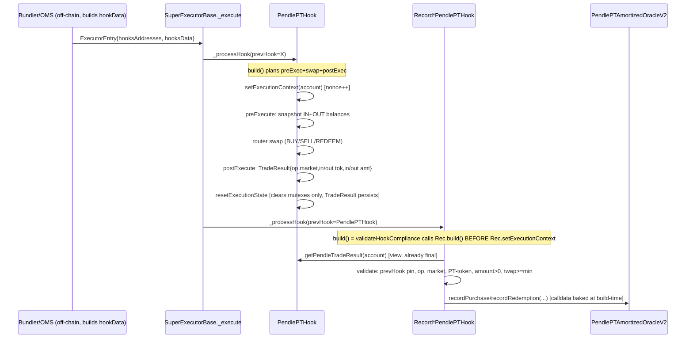

# Spec-Flow Analysis — Pendle PT Record Hooks

Analysis of `specs/pendle-pt-record-hooks/interview-notes.md` against the codebase mechanics
documented in `research/repo-analysis.md`, `research/framework-docs.md`,
`research/best-practices.md`, and `research/evm-security.md`. This document treats each
ERC-7579 hook sequence as a "user flow" (the user is the strategy signer / bundler / SuperBundler
constructing the sequence; the "session" is one atomic transaction). Goal: enumerate every
execution-flow permutation, surface gaps the four research docs did not fully close, and turn them
into concrete acceptance criteria before implementation starts.

Two facts, verified directly in `src/executors/SuperExecutorBase.sol`, ground everything below and
are not repeated as open questions:

1. **`_execute` loops hooks strictly sequentially, and each hook's `_processHook` fully completes
   (`validateHookCompliance` → `build()` → `setExecutionContext` → execute the built
   `Execution[]` → `lastCaller` check → `resetExecutionState` → `_updateAccounting`) before the
   next hook's `_processHook` even starts** (`SuperExecutorBase.sol:158-176, 300-331`). So when
   `RecordPurchasePendlePTHook.build()` runs, `PendlePTHook`'s `_postExecute` has already written
   the final `TradeResult` for that execution — there is no window where the recorder's `build()`
   can observe a half-populated result from the *same* preceding trade. This closes the
   read-only-reentrancy question for the "recorder reads prevHook" step specifically (it does
   **not** close reentrancy *during* PendlePTHook's own swap, which stays a live concern, see
   G-9).
2. **`prevHook` is derived positionally by the executor's loop (`prevHook = currentHook` from the
   prior iteration), not attacker-suppliable calldata** (`SuperExecutorBase.sol:166-176`). An
   attacker cannot set `prevHook` to `PendlePTHook`'s address unless `PendlePTHook` is genuinely
   `hooksAddresses[i-1]` in that specific `ExecutorEntry`. Combined with the immutable
   `APPROVED_PENDLE_PT_HOOK` pin, "prev-hook spoofing" collapses to a single on-chain `==` check
   with no bypass via calldata alone (Merkle/strategy authorization is the remaining outer gate on
   which sequences can be submitted at all).

---

## Execution-Flow Overview

### Flow catalog (each is a distinct execution-flow permutation to test)

| # | Flow | Sequence | Expected result |
|---|---|---|---|
| F1 | Buy → purchase recorder, manual | `[PendlePTHook(BUY_PT), RecordPurchase(amount=N, usePrev=false)]` | Records `N`, ignores actual delta |
| F2 | Buy → purchase recorder, automatic | `[PendlePTHook(BUY_PT), RecordPurchase(amount=0, usePrev=true)]` | Records `TradeResult.outputAmount` |
| F3 | Sell → redemption recorder, manual | `[PendlePTHook(SELL_PT), RecordRedemption(amount=N, usePrev=false)]` | Records `N` |
| F4 | Sell → redemption recorder, automatic | `[PendlePTHook(SELL_PT), RecordRedemption(amount=0, usePrev=true)]` | Records `TradeResult.inputAmount`, **not** `outputAmount` |
| F5 | Matured redeem → redemption recorder, automatic | `[PendlePTHook(REDEEM_PT), RecordRedemption(amount=0, usePrev=true)]` | Same as F4, op=`REDEEM_PT` |
| F6 | Matured redeem → redemption recorder, manual | `[PendlePTHook(REDEEM_PT), RecordRedemption(amount=N, usePrev=false)]` | Records `N` |
| F7 | **Wrong pairing** — Buy → redemption recorder | `[PendlePTHook(BUY_PT), RecordRedemption(...)]` | **Must revert** — op mismatch |
| F8 | **Wrong pairing** — Sell → purchase recorder | `[PendlePTHook(SELL_PT), RecordPurchase(...)]` | **Must revert** — op mismatch |
| F9 | **Wrong pairing** — Redeem → purchase recorder | `[PendlePTHook(REDEEM_PT), RecordPurchase(...)]` | **Must revert** — op mismatch |
| F10 | Manual mode, zero encoded amount, `usePrev=false` | `amount=0, usePrev=false` | **Must revert** `AMOUNT_NOT_VALID` (not silently pass through) |
| F11 | Automatic mode, zero actual delta | `usePrev=true`, but `TradeResult.output/inputAmount==0` (e.g. unfilled limit order) | **Ambiguous — see G-1** |
| F12 | Recorder as first hook | `[RecordPurchase(...)]`, `prevHook=address(0)` | **Must revert** via pin check, not a low-level empty-returndata revert |
| F13 | Foreign hook between trade and recorder | `[PendlePTHook, SomeOtherHook(PASSTHROUGH), RecordPurchase]` | **Must revert** via pin check (`prevHook != APPROVED`) |
| F14 | Recorder called twice | `[PendlePTHook, RecordPurchase, RecordPurchase]` | Second call's `prevHook == RecordPurchase#1` → **must revert** via pin check |
| F15 | Two PendlePTHook trades, recorders adjacent | `[BUY(A), RecordPurchase(A), BUY(B), RecordPurchase(B)]` | Each recorder records its own trade only |
| F16 | Two PendlePTHook trades, recorder misaligned | `[BUY(A), BUY(B), RecordPurchase(market=A, usePrev=true)]` | `prevHook`=`PendlePTHook` (pin OK) but its *current* context is B's trade → **must revert** on market mismatch, not silently record B's amount under A's market |
| F17 | PendlePTHook swap reverts mid-execution (e.g. slippage) | `[PendlePTHook(min-out unmet), RecordPurchase]` | Entire tx reverts atomically; recorder never runs, no orphaned state |
| F18 | Cross-account | Account A's sequence somehow reads Account B's `TradeResult` | Structurally unreachable (`account` is executor-supplied, not calldata) — assert via fuzz, not by exposing a bypass |
| F19 | Stale/empty `TradeResult` (op==NONE) | Recorder placed after a hook that never ran `postExecute`, or after `PendlePTHook` used only for `inspect()`/dry validation | **Must revert** — treat `Operation.NONE` as "unpopulated," distinct error from op-mismatch |
| F20 | Market-mismatch: recorder's own `market` calldata ≠ `TradeResult.market` | `RecordPurchase(market=Y)` after `PendlePTHook(market=X)` traded | **Must revert** `MARKET_MISMATCH` |
| F21 | PT-token mismatch: `TradeResult.outputToken` (buy) / `inputToken` (sell/redeem) ≠ `market.readTokens().pt` | Malicious/misconfigured market | **Must revert** `PT_TOKEN_MISMATCH` |
| F22 | `twapDuration` below oracle minimum | Purchase recorder, any amount mode | **Must revert**, ideally hook-side before the oracle call |
| F23 | `twapDuration` supplied but market expired | Purchase recorder targets a market at/after `pt.expiry()` | Oracle reverts `MARKET_EXPIRED`; should this even be reachable given `PendlePTHook` would have routed to `REDEEM_PT` for that market? See G-11 |

---

## Missing Elements & Gaps (prioritized)

### Critical

**G-1. Zero-fill automatic mode is unresolved: hard revert vs. graceful no-op.**
- **Where:** F11. `usePrevHookAmount == true` and `resolvedAmount == 0` because the *actual* trade
  moved zero PT (e.g., a Pendle limit-order component that didn't fill, or a swap whose realized
  output rounds to zero). The interview's rule (`resolvedAmount == 0 → revert AMOUNT_NOT_VALID`)
  treats this identically to a misconfigured manual-mode zero — but semantically it's different:
  in F10 the caller made a mistake; in F11 the trade *genuinely happened* but moved nothing
  recordable.
- **Impact:** Because the record hook runs in the *same atomic sequence* as the trade, reverting
  here reverts the **entire strategy action** (deposit, swap, any downstream hooks) on a
  legitimately-executed-but-zero-fill trade — a DoS on an otherwise-successful user action.
- **Ask:** Is a zero-fill BUY/SELL/REDEEM expected to happen in practice (do Pendle limit orders
  used via `PendlePTHook` ever legitimately net to zero PT movement), and if so, should the
  recorder in automatic mode become a silent no-op (skip the oracle call) rather than revert?
- **Proposed resolution:** Keep the revert for manual mode (F10 — it's a real caller bug). For
  automatic mode, explicitly decide one of: (a) revert is intentional and acceptable because a
  strategy author should never chain a recorder after a trade that might zero-fill (document this
  as an operational constraint), or (b) add a distinct `usePrevHookAmount && resolvedAmount == 0`
  no-op path that returns zero `Execution`s (skips the oracle call) instead of reverting. Pick one
  and add it as an explicit acceptance criterion — the current AC list only says "zero resolved
  amount reverts in both," which reads as covering F10 but is silent on F11.

**G-2. OMS "schema" for the new hooks is not actually specified anywhere.**
- **Where:** AC item "Hook-registry normalization accepts both automatic and manual modes using
  the new schemas." Grepping this repo for OMS normalization logic (`syAccountingAssetSpent`,
  `*oms*`) returns **nothing** — OMS lives entirely outside `v2-core` and only consumes
  `manifests/hooks.json` + `hook-sizing-manifest.json`. This spec (and this repo) can define the
  on-chain calldata layout and the sizing-manifest `mode:"sizeless"` entry, but it cannot itself
  guarantee OMS will render two clean toggle-able schemas ("manual: amount+market(+twapDuration)"
  vs. "automatic: market(+twapDuration) only, amount hidden/ignored") — that UI/normalization
  logic is a separate codebase change. This is exactly the class of bug that caused the motivating
  incident (`syAccountingAssetSpent required` even though the V2 contract didn't need it).
- **Impact:** Without an explicit OMS-side schema definition, the same failure mode recurs: the
  contracts support automatic mode correctly, but OMS treats a field as mandatory that shouldn't
  be, or fails to expose the `usePrevHookAmount` toggle at all for the new hook keys.
- **Proposed resolution:** Add a companion deliverable (ticket or appendix) enumerating, per new
  hook, the exact `hook_params` field list OMS should generate for manual vs. automatic mode,
  mirroring the pattern that fixed the V1→V2 purchase recorder (drop `syAccountingAssetSpent`).
  Do not close this feature as "done" on the strength of `hook-sizing-manifest.json` alone —
  require a manual OMS-side smoke test (build a strategy through the actual UI/normalizer in both
  modes) as a release gate, not just a manifest schema check.

**G-3. Double `market.readTokens()` call: intentional defense-in-depth or an open question?**
- **Where:** `evm-security.md`'s validation checklist recommends the record hook independently
  call `IPMarket(TradeResult.market).readTokens()` to re-derive PT and compare against
  `TradeResult.outputToken`/`inputToken`, on top of `PendlePTHook` having already done the same
  call to route the trade. The interview notes only say "validate output/input token is the PT
  from `market.readTokens()`" without specifying *whose* call.
- **Impact:** If the record hook trusts `TradeResult.outputToken`/`inputToken` directly (no second
  call), it saves gas but relies entirely on `PendlePTHook`'s own validation at build-time. If it
  re-calls `readTokens()`, it pays for a second external call into a still-untrusted (calldata-
  chosen) `market` contract, which reopens the griefing/returnbomb/revert surface (`evm-
  security.md` §7.2/§13.1) *inside the recorder itself* — a new DoS vector on a hook that was
  supposed to keep `build()` free of untrusted calls (evm-security.md's own "DoS-minimization"
  bullet says "Do not add external calls in the record hook beyond `readTokens()`" — implicitly
  assuming the call is needed, but doesn't reconcile this against the "keep build() free of
  untrusted calls" bullet a few lines above it in the same document).
  Note also: since `market` is the *same* address in both calls within the *same* transaction, a
  malicious market contract could legitimately return a *different* PT address on the second call
  (e.g., branching on `msg.sender` or a call counter) even though it returned a consistent
  (validated) PT on the first call inside `PendlePTHook`. If that happens, the record hook's
  independent check could itself be fed a fabricated "PT" for comparison, giving false confidence
  where the *first* call already anchored the true trade.
- **Proposed resolution:** Recommend **not** re-calling `readTokens()` in the record hook.
  Instead validate purely from `TradeResult` fields, which were already derived from a single
  `readTokens()` call inside `PendlePTHook` at trade time: check `TradeResult.outputToken == PT`
  is unnecessary to re-derive — what actually matters is that `TradeResult.market` equals the
  recorder's own committed `market` (G-uses F20) and that `TradeResult.operation` matches
  (F7-F9). The PT-identity risk is already owned by `PendlePTHook`'s trust boundary (documented in
  its own NatSpec) and re-validating it in the recorder via a second call to the same
  attacker-influenced address adds cost without closing a new hole. If the team disagrees and
  wants the second call anyway (belt-and-suspenders), require it to be gas-bounded
  (`readTokens()` is a `view` external call — cap or catch reverts explicitly) and document why
  it's considered worth the added attack surface. Either way, **make the decision explicit in the
  spec**, since the two research docs currently give conflicting defaults.

**G-4. Merkle-root / allowed-sequence migration mechanics are asserted, not specified.**
- **Where:** Interview's migration section says "update strategy Merkle roots / allowed hook
  sequences before enabling" and "retain old hook records/addresses for historical decoding but
  block new strategies from the incompatible versions" — both are goals, neither states the
  mechanism.
- **Open questions a reviewer will ask:**
  1. Is switching an *existing, already-deployed* strategy from the old V2 record hooks to the new
     ones a same-account Merkle-root rotation, or does it require deploying a new strategy/account?
     Who signs/executes the root rotation, and is there a timelock?
  2. Is "blocking new strategies from the incompatible (old) versions" enforced **on-chain**
     (old hook addresses simply never appear in any *newly generated* Merkle root) or purely
     **off-chain/UI** (OMS stops offering them in the builder while old, already-authorized
     accounts could still submit calldata referencing the old hook addresses if their existing
     root still covers that leaf)? These have very different security postures.
  3. During the migration window, can a single strategy account have *both* an old-hook-referencing
     leaf and a new-hook-referencing leaf simultaneously valid under the same root (to allow
     gradual cutover), or is it strictly one-root-one-version?
- **Note (resolved, not a gap):** Book-value continuity across old→new record hooks is *not* at
  risk mechanically — `record V2 hooks and the new ones both target the same
  `PendlePTAmortizedOracleV2` address with the same `recordPurchase/recordRedemption` selectors,
  so `BookValueState` keyed by `(strategy, market)` is oblivious to which hook version wrote it
  (confirmed in `best-practices.md` §5). Only the *authorization* layer (Merkle roots) needs a
  real answer, not the accounting layer.
- **Proposed resolution:** Get an explicit answer from whoever owns strategy/Merkle governance
  (pod-lead) before writing the deploy runbook; add it as a named acceptance criterion rather than
  leaving "update Merkle roots" as a bullet with no owner or mechanism.

### Important

**G-5. `twapDuration` freshness across governance changes is implicitly fine, but undocumented.**
- Because `PendlePTHook.inspect()`/the record hooks' `inspect()` commit **only the market**
  (repo-analysis §4), `twapDuration` (like `amount` and `usePrevHookAmount`) is *not* part of the
  Merkle-committed intent — it's supplied fresh in execution-time calldata by whoever submits the
  transaction (SuperBundler/OMS). This means a governance-side `setMinTwapDuration` change on the
  oracle does **not** require re-authorizing any already-signed strategy — the next execution just
  needs fresh calldata with a compliant `twapDuration`. This is good news but is nowhere stated in
  the spec, and it has an operational corollary: **whoever builds execution-time calldata (OMS/
  bundler) must query the *current* `getMinTwapDuration(market)` at submission time**, not a value
  cached from when the strategy was authored — otherwise a previously-valid `twapDuration` silently
  starts reverting after governance raises the minimum. Add this as an explicit
  operational/acceptance note, and add a test that changes `marketMinTwapDuration` between
  strategy authorization and execution to prove old commitments still work with fresh calldata.

**G-6. Hook-side TWAP pre-check vs. relying solely on the oracle's revert.**
- `evm-security.md` recommends asserting `twapDuration >= getMinTwapDuration(market)` in the hook
  itself (defense-in-depth, clearer error) in addition to the oracle's own guard. The interview
  notes don't call this out as a requirement. Decide explicitly: does the purchase recorder make
  an extra view call to `oracle.getMinTwapDuration(market)` before building the `Execution`, or
  does it rely purely on the oracle's `TWAP_DURATION_TOO_SHORT` revert? The former adds a read
  (cheap, same trusted oracle) and gives a hook-level custom error name matching the pattern used
  for the other validations (op mismatch, market mismatch, etc.); the latter saves a call but
  produces an error that originates from the *oracle* contract instead of the hook, which is
  inconsistent with every other validation in this spec being hook-owned. **Recommend the
  pre-check** for error-message consistency; add as acceptance criterion either way.

**G-7. Distinct custom errors per failure mode, not shared generics.**
- The current V2 recorder has exactly two errors (`MARKET_NOT_VALID`, `PT_AMOUNT_NOT_VALID`). The
  new hooks add several new failure modes (wrong prevHook, op mismatch, market mismatch, PT-token
  mismatch, sub-min TWAP if pre-checked) that the interview's AC list mentions only in prose
  ("Both reject: mismatched market, wrong PT token, incompatible prev hook, stale execution
  context, result belonging to another account"). Nothing specifies whether these are one shared
  `INVALID_TRADE_RESULT()` catch-all or distinct named errors. Distinct errors materially help
  off-chain debugging/monitoring (a griefing market vs. a genuine misconfiguration vs. an
  operator error look identical under one generic revert). **Proposed resolution:** require named
  errors — e.g. `WRONG_PREV_HOOK()`, `OPERATION_MISMATCH()`, `MARKET_MISMATCH()`,
  `PT_TOKEN_MISMATCH()`, `AMOUNT_NOT_VALID()`, and (if G-6 is accepted)
  `TWAP_DURATION_TOO_SHORT()` — as an explicit acceptance criterion with one unit test per error.

**G-8. Check ordering: pin check must run before any prevHook call.**
- F12 (recorder as first hook, `prevHook == address(0)`) and F13/F14 (wrong-contract prevHook) must
  produce the hook's own clean `WRONG_PREV_HOOK()` revert, not a low-level "empty returndata"
  revert from attempting to ABI-decode a zero-length return from calling
  `IPendlePTHookResult(address(0)).getPendleTradeResult(account)` (or from calling an arbitrary
  non-implementing contract). This means the constructor-pinned `prevHook == APPROVED_PENDLE_PT_HOOK`
  check **must be the first statement** in `_buildHookExecutions`, before any call into `prevHook`.
  This is implied by the design but not stated as an explicit ordering requirement — add it as an
  acceptance criterion with a test asserting the *specific* revert reason for F12/F13/F14 (not just
  "reverts").

**G-9. Reentrancy window during `PendlePTHook`'s own swap execution is still open — scope it explicitly.**
- Grounding fact #1 above closes reentrancy *between* the trade hook finishing and the record hook
  reading it. It does **not** close reentrancy **during** the swap itself: a PT/YT/SY/output token
  with a transfer callback (ERC-777-style) could re-enter *between* `PendlePTHook._preExecute`'s
  snapshot and `_postExecute`'s delta computation, mutating `account`'s balance via some other path
  and corrupting the very delta the recorder will later trust as ground truth. `evm-security.md`
  already flags this (§1.5/§10.4, AS-4) but the interview's security-focus section only lists
  "Reentrancy around the pre/post balance snapshots" as a research topic, not a resolved
  mitigation. **Ask:** is the PT/SY/asset token universe here permissioned/allowlisted enough
  (Pendle-issued PT/SY plus a known asset set) that ERC-777-style callback tokens are structurally
  excluded, or does the spec need an explicit reentrancy guard / allowlist check on the input and
  output token addresses before trusting the delta? If the answer is "the token universe is
  trusted by construction (derived from `market.readTokens()` on a Merkle-authorized market)," say
  so explicitly in the spec as the accepted residual risk, rather than leaving it implicit.

**G-10. "Result belonging to another account" (F18) — assert as an invariant with a test, not a
runtime check.**
- The AC list says "Both reject: ... result belonging to another account," phrased as if the hook
  needs *runtime logic* to detect and reject this. But per grounding fact #2, `account` is supplied
  by the executor from `msg.sender`'s own execution context, not from attacker calldata — there is
  no code path where the record hook could be handed a *different* account's `TradeResult` short
  of a bug in `BaseHook`'s account-keying itself. **Proposed resolution:** reword this AC from "the
  hook rejects a foreign-account result" (implying new validation code) to "the hook is
  structurally incapable of reading a foreign account's result; prove this with a fuzz test
  spawning two accounts trading in the same tx and asserting no cross-read" — otherwise an
  implementer may add dead/misleading "account-matching" code that doesn't correspond to any real
  attacker-reachable input.

**G-11. Purchase recorder targeting an already-expired market — is this reachable, and what's the
error?**
- F23: `PendlePTAmortizedOracleV2.recordPurchase` reverts `MARKET_EXPIRED` at/after `pt.expiry()`.
  But `PendlePTHook` itself would only reach `BUY_PT` routing if `headerOutputToken == pt` — Pendle's
  router (`swapExactTokenForPt`) presumably also rejects buying PT on an expired market, or does it
  silently succeed at a degenerate price? If the router allows it, the trade could succeed and the
  purchase recorder would then hard-DoS-revert the whole sequence on `MARKET_EXPIRED` *after* the
  swap already happened (funds moved, nothing recorded, but the tx as a whole still reverts so
  funds return — confirm this is atomic and acceptable). **Proposed resolution:** add a fork test
  that attempts a BUY on a market within one block of expiry and confirms whether Pendle's router
  itself blocks it (making the oracle's `MARKET_EXPIRED` guard unreachable in practice) or whether
  the oracle guard is the actual backstop (making F23 a real, testable path, not dead code).

**G-12. `PipeMode.PASSTHROUGH` verification for the record hooks' effect on hook #3+ in a chain.**
- Interview requires "passthrough preserves prev hook's output amount + output token for downstream
  hooks." Concretely: after `RecordPurchase` runs, a hook at position i+2 reading
  `getOutAmount(account)` on the record hook must see `PendlePTHook`'s **output** amount (PT
  bought) — this is correct and expected for the purchase side (output token is already PT). But
  for the **redemption** recorder, passthrough forwards `PendlePTHook`'s output (the *asset
  received*, e.g. USDC), which is correct for a downstream hook that wants to act on the received
  asset (e.g. a deposit hook chained after a sell) — confirm this is the intended downstream
  semantic (asset-out, not PT-in) since it's easy to assume "record hook passes through the PT
  amount it just recorded" when it actually should pass through the *swap's own* output, which for
  redemption is a different token entirely than what was just recorded. Add this exact distinction
  as an explicit test: `getOutToken()` after `RecordRedemption` == the asset token, not PT.

### Nice-to-have / clarity

**G-13. Naming symmetry for the "market mismatch" three-way relationship.**
As detailed in framework-docs/repo-analysis, there are three "market" values in play for a given
trade+record pair: (1) the record hook's own calldata `market` (used for both the oracle call and
the Merkle `inspect()` commitment), (2) `PendlePTHook`'s own calldata `market` for the same swap
(used for routing and its own `inspect()` commitment), (3) `TradeResult.market` (copied from (2) by
`PendlePTHook`). The required check is (1) == (3) [which transitively pins (1) == (2)]. Spell this
out explicitly in the spec with the three labels used consistently, so an implementer doesn't
accidentally compare (1) against (2) via some other path and get a false sense of coverage.

**G-14. Historical-decoding requirement needs an indexer-facing artifact, not just "keep old
addresses."**
`best-practices.md` correctly notes address→version is the durable key for an indexer choosing a
decoder. The interview's migration section doesn't name *who* consumes this (an internal indexer?
a public subgraph?) or what artifact records the address→ABI-version mapping going forward. If this
already exists elsewhere (e.g. `manifests/hooks.json` is treated as that source of truth), say so
explicitly so this isn't rediscovered as a gap later.

**G-15. Event schema for the new hooks — inherited from the oracle, or hook-level events too?**
`PendlePTAmortizedOracleV2` already emits `PurchaseRecorded`/`BookValueUpdated`/redemption
equivalents. Do the new record hooks themselves need to emit anything (e.g., an event carrying
`usePrevHookAmount` and the resolved amount, for off-chain reconciliation of "was this
manual or automatic"), or is the oracle's event considered sufficient? Worth a one-line decision
in the spec since hooks in this codebase are otherwise silent (no hook-level events observed in
the V2 record hooks).

---

## Critical Questions Requiring Clarification

1. **(Critical, G-1)** When `usePrevHookAmount == true` resolves to an *actual* zero-amount trade
   (not a caller error, but a genuine zero-fill), should the record hook revert (current spec) or
   no-op? *Default if unanswered:* keep the revert (matches the literal AC text), but explicitly
   document that this makes zero-fill Pendle limit-order legs incompatible with any chained
   recorder, and add a fork/unit test proving whether `PendlePTHook`'s limit-order path can
   actually produce a zero-output `BUY_PT`/zero-input `SELL_PT` in practice.

2. **(Critical, G-2)** Who owns and signs off on the OMS-side schema (field names, required/
   optional, UI toggle behavior) for `hook_params` of the two new hooks, and will it be validated
   against an actual OMS build (not just the sizing manifest) before this ships? *Default if
   unanswered:* treat "manifests regenerated + `validate-hook-sizing-manifest.ts` passes" as
   necessary but **not sufficient**; block release on a manual OMS smoke test in both modes.

3. **(Critical, G-3)** Should the record hooks independently re-call `market.readTokens()`, or
   trust `TradeResult.outputToken`/`inputToken` as already-validated by `PendlePTHook`? *Default
   if unanswered:* do **not** re-call (trust `TradeResult`); re-validating against the same
   untrusted address adds attack surface without closing a materially new hole, per the reasoning
   in G-3.

4. **(Critical, G-4)** What is the concrete mechanism and owner for Merkle-root/allowed-sequence
   migration — on-chain hard block of old hook addresses in new roots, or off-chain/UI-only
   gating? *Default if unanswered:* escalate to the strategy/Merkle governance owner before
   writing the deploy runbook; do not let "update Merkle roots" ship as an unowned checklist item.

5. **(Important, G-6)** Does the purchase recorder pre-check `twapDuration >=
   getMinTwapDuration(market)` itself, or rely solely on the oracle's revert? *Default if
   unanswered:* add the hook-side pre-check for consistent, hook-owned error naming (matches G-7).

6. **(Important, G-9)** Is the PT/SY/asset token universe considered structurally immune to
   reentrant-callback tokens (so no extra guard is needed around `PendlePTHook`'s pre/post
   snapshots), or does this feature need an explicit reentrancy guard / token allowlist check?
   *Default if unanswered:* document the "trusted token universe via `readTokens()` on a
   Merkle-authorized market" assumption explicitly as the accepted residual risk, matching the
   existing `PendlePTHook` NatSpec stance on market trust.

7. **(Important, G-11)** Can a `BUY_PT` actually reach the oracle's `MARKET_EXPIRED` guard in
   practice (i.e., does Pendle's router allow buying PT on an expired market), or is that guard
   dead code from this integration's perspective? *Default if unanswered:* add the fork test
   regardless — cheap to write, resolves the ambiguity either way.

8. **(Nice-to-have, G-15)** Do the new record hooks emit their own event (e.g., capturing
   `usePrevHookAmount`) or rely entirely on the oracle's existing events? *Default if unanswered:*
   no new event (match the existing V2 record hooks' silence), since the oracle's `PurchaseRecorded`/
   redemption events already carry the recorded amount and market.

---

## Additional Acceptance Criteria to Add

Beyond the interview's existing AC list, add:

- [ ] F16 (misaligned recorder after multiple same-tx PendlePTHook trades) reverts on market
  mismatch, not silent misrecording — explicit test with two markets traded in one sequence.
- [ ] F12/F13/F14 (first-hook, foreign-hook, double-recorder) each revert with the **specific**
  `WRONG_PREV_HOOK()` error, verified before any call into `prevHook` (G-8) — not a generic revert
  or an ABI-decode-of-empty-returndata revert.
- [ ] Distinct named custom errors per validation failure (G-7): `WRONG_PREV_HOOK`,
  `OPERATION_MISMATCH`, `MARKET_MISMATCH`, `PT_TOKEN_MISMATCH`, `AMOUNT_NOT_VALID`, and (if G-6
  accepted) a hook-level `TWAP_DURATION_TOO_SHORT`.
- [ ] G-1 resolution encoded as a test either way: either "zero-fill automatic-mode trade reverts
  the whole sequence (documented as accepted behavior)" or "zero-fill automatic-mode trade is a
  clean no-op with zero `Execution`s emitted."
- [ ] G-5: a test that authorizes a strategy, then raises `marketMinTwapDuration` via governance,
  then executes with fresh (compliant) execution-time calldata — proving no re-authorization is
  needed because `twapDuration` isn't Merkle-committed.
- [ ] G-10 reframed: a fuzz test with two distinct accounts trading in the same transaction,
  asserting no cross-account `TradeResult` read is possible (proves the invariant rather than
  testing dead defensive code).
- [ ] G-12: explicit downstream-hook test proving `getOutToken()`/`getOutAmount()` after
  `RecordRedemption` reflect the **swap's output token/amount** (e.g. USDC received), not the PT
  amount just recorded.
- [ ] F17: a test that `PendlePTHook`'s swap reverting (e.g. min-out not met) reverts the entire
  sequence atomically, with the record hook's oracle call never reaching the mempool/state
  (nothing partially recorded).
- [ ] G-11: fork test attempting a `BUY_PT` at/after a market's `pt.expiry()` to determine whether
  Pendle's router or the oracle's `MARKET_EXPIRED` guard is the actual backstop.
- [ ] G-2: a manual (non-automated) OMS build-through-UI smoke test in both manual and automatic
  modes, run as a release gate, not inferred from manifest generation alone.

---

## Recommended Next Steps

1. Resolve the four **Critical** questions (G-1 through G-4) with the pod-lead / relevant owners
   before writing code — G-2 and G-4 in particular touch systems outside this repo and need an
   explicit owner, not just a checklist bullet.
2. Decide G-3 (double `readTokens()` call) explicitly and note the decision + rationale in the
   spec, since `best-practices.md` and `evm-security.md` currently point in different directions.
3. Fold the new acceptance criteria above into the spec's AC list before implementation starts,
   especially F16/F12-F14/G-8 (error-ordering) and G-1 (zero-fill semantics), since these change
   what "correct" code looks like, not just what tests to add after the fact.
4. Confirm G-9's reentrancy assumption (trusted token universe) explicitly in the spec's security
   section rather than leaving it as an open research note — this determines whether
   `_postExecute`'s balance-delta computation needs any additional guard.
5. Write the two fork tests called out in G-11 and F17 early (they're cheap and resolve real
   ambiguity about which guard is the actual backstop), rather than leaving them for the tail end
   of the test-writing pass.
