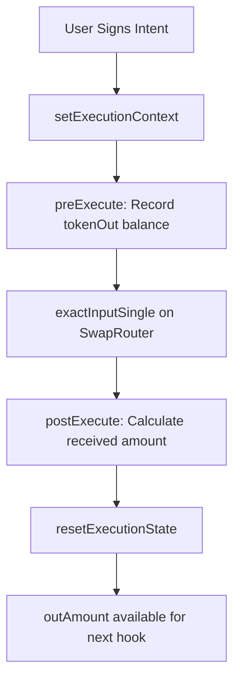
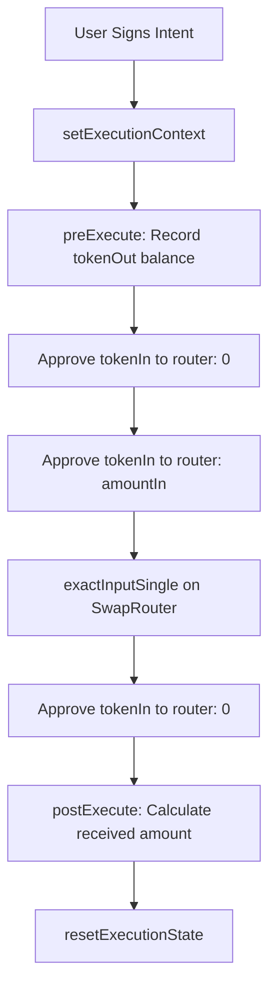
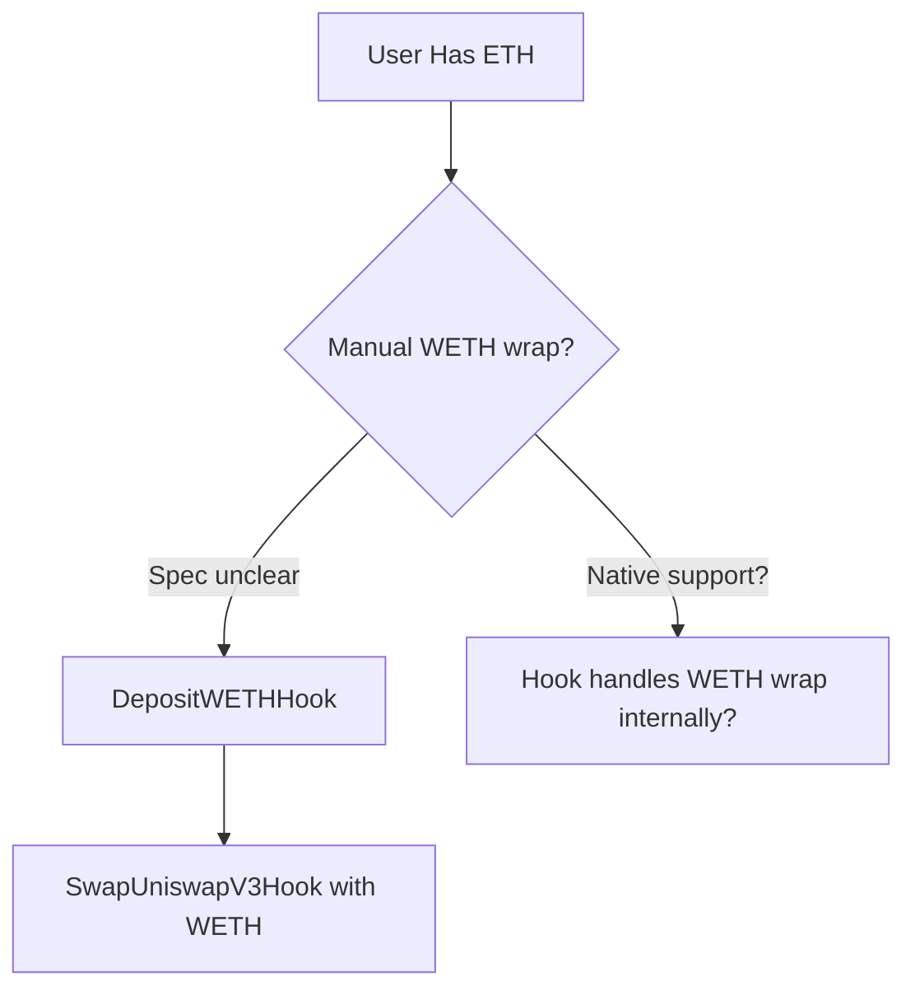
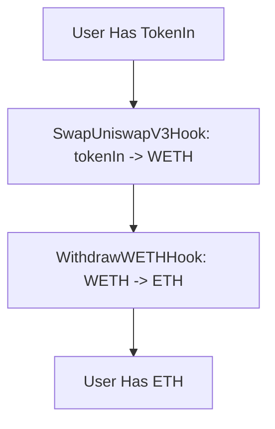
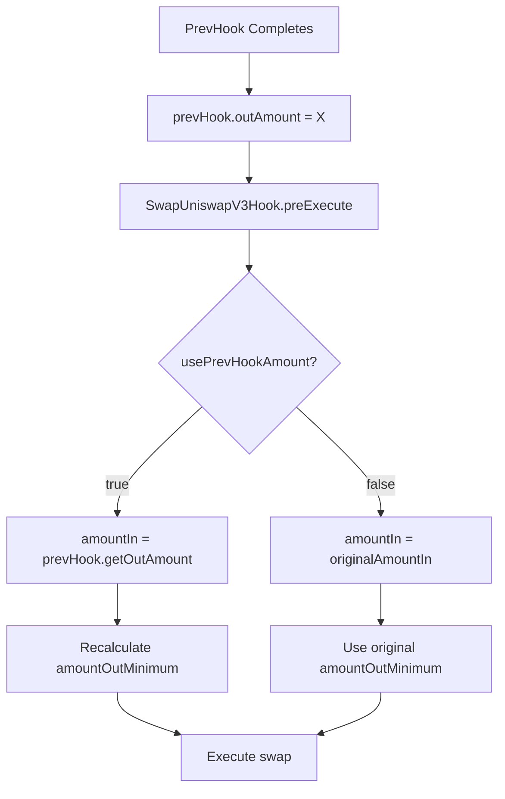
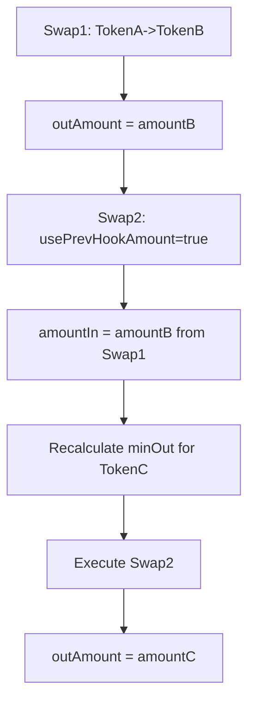
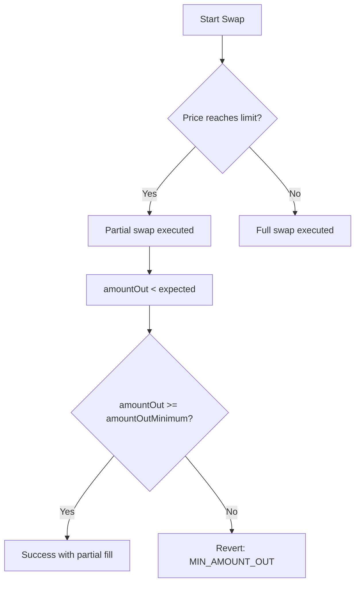

# Uniswap V3 Hook - User Flow & Gap Analysis

**Date**: 2026-01-30
**Analyzer**: Claude Code (Flow Analysis Mode)
**Specification Version**: v1.0

---

## Executive Summary

This document provides an exhaustive analysis of all user flows, edge cases, and specification gaps for the proposed Uniswap V3 Hook implementation. The analysis is based on:
- The provided specification
- Existing Superform v2-core hook patterns (Odos, WETH, Approve patterns)
- Uniswap V3 SwapRouter interface requirements
- BaseHook architecture and execution lifecycle

**Critical Finding**: The specification contains **23 critical gaps** and **17 important clarifications** needed before implementation can begin safely.

---

## User Flow Overview

### Flow 1: Standalone ERC-20 to ERC-20 Swap (Pre-approved)
**Hook**: `SwapUniswapV3Hook`
**Precondition**: User has already approved tokenIn to SwapRouter
**Entry Point**: User signs intent with swap parameters



**States**:
- Initial: User has tokenIn balance, tokenIn approved to router
- Intermediate: Swap executing on Uniswap V3 pool
- Final: User has tokenOut balance, outAmount set to received tokens

**Failure Points**:
- Insufficient tokenIn balance
- Insufficient approval amount
- Pool doesn't exist for fee tier
- Slippage exceeded (amountOut < amountOutMinimum)
- Deadline expired
- sqrtPriceLimitX96 reached before full swap

---

### Flow 2: Standalone ERC-20 to ERC-20 Swap (With Approval)
**Hook**: `ApproveAndSwapUniswapV3Hook`
**Precondition**: User has tokenIn balance but no prior approval
**Entry Point**: User signs intent with swap parameters



**States**:
- Initial: User has tokenIn, no approval
- Approval Phase: Approval set to 0, then amountIn, then back to 0
- Swap Phase: Token exchange occurs
- Final: User has tokenOut, no lingering approval

**Failure Points**:
- All Flow 1 failure points PLUS:
- First approve(0) fails due to non-standard token
- Second approve(amountIn) fails
- Final approve(0) cleanup fails (non-critical but leaves approval)

---

### Flow 3: Native ETH Input Swap
**Hook**: Either variant (see gap #1)
**Precondition**: User has ETH balance
**Entry Point**: User wants to swap ETH for tokenOut



**CRITICAL GAP**: Specification states "Support native ETH...with WETH wrapping for ETH" but doesn't specify:
- Does hook wrap internally or require chaining with DepositWETHHook?
- If internal wrapping, where in execution lifecycle?
- How does msg.value get passed if wrapping internally?

---

### Flow 4: Native ETH Output Swap
**Hook**: Either variant
**Precondition**: User has tokenIn
**Expected Result**: User receives unwrapped ETH



**CRITICAL GAP**: Specification says "Native ETH output" but:
- Does hook automatically unwrap WETH to ETH?
- Or must user chain with WithdrawWETHHook?
- If auto-unwrap, how to distinguish user intent (keep WETH vs unwrap)?

---

### Flow 5: Chained Swap (Previous Hook Provides Input)
**Hook**: Either variant
**Precondition**: Previous hook executed, has outAmount > 0
**Data Parameter**: `usePrevHookAmount = true`



**Slippage Recalculation Logic** (from spec):
```
newAmountOutMin = originalMinAmountOut * (1 - maxSlippageDeviationBps/10000)
                * (actualAmountIn / originalAmountIn)
```

**Critical Questions**:
- What if actualAmountIn > originalAmountIn significantly (price improved)?
- What if actualAmountIn < originalAmountIn significantly (previous hook failed partially)?
- Does maxSlippageDeviationBps apply to original quote or dynamically?

---

### Flow 6: Multi-Hop Chained Swaps
**Scenario**: TokenA → TokenB → TokenC using two hooks



**Edge Cases**:
- What if intermediate token (TokenB) has fee-on-transfer?
- What if price moves significantly between Swap1 and Swap2?
- How to handle if Swap1 succeeds but Swap2 fails slippage?

---

### Flow 7: Swap with Partial Price Limit
**Scenario**: User sets sqrtPriceLimitX96 to stop swap at certain price
**Result**: May receive less than expected, but within limits



**Gap**: How should slippage recalculation handle sqrtPriceLimitX96 scenarios?

---

## Flow Permutations Matrix

| Flow ID | Token In | Token Out | Approval | Chained | Expected Hook Variant | Critical Dependencies |
|---------|----------|-----------|----------|---------|----------------------|----------------------|
| 1.1 | ERC-20 | ERC-20 | Pre-approved | No | SwapUniswapV3Hook | Token balances, pool exists |
| 1.2 | ERC-20 | ERC-20 | Pre-approved | Yes (usePrev=true) | SwapUniswapV3Hook | prevHook.outAmount, slippage calc |
| 2.1 | ERC-20 | ERC-20 | Needs approval | No | ApproveAndSwapUniswapV3Hook | Token compatibility with approve(0) |
| 2.2 | ERC-20 | ERC-20 | Needs approval | Yes (usePrev=true) | ApproveAndSwapUniswapV3Hook | Same as 2.1 + prevHook deps |
| 3.1 | Native ETH | ERC-20 | N/A | No | **UNSPECIFIED** | WETH address, wrapping mechanism |
| 3.2 | Native ETH | ERC-20 | N/A | Yes | **UNSPECIFIED** | Same as 3.1 + prevHook deps |
| 4.1 | ERC-20 | Native ETH | Varies | No | **UNSPECIFIED** | Unwrapping mechanism |
| 4.2 | ERC-20 | Native ETH | Varies | Yes | **UNSPECIFIED** | Same as 4.1 + prevHook deps |
| 5.1 | ERC-20 | ERC-20 | Pre-approved | No | SwapUniswapV3Hook | sqrtPriceLimitX96 behavior |
| 5.2 | ERC-20 | ERC-20 | Pre-approved | No | SwapUniswapV3Hook | Deadline enforcement |

**User Context Variations**:
- **First-time user**: May not understand chaining, usePrevHookAmount
- **Returning user**: Familiar with hook composition
- **Cross-chain user**: May have different router addresses per chain
- **MEV-aware user**: Uses tight deadlines and sqrtPriceLimitX96

**Device/Platform Variations**:
- **Desktop wallet**: Full signature control, can review all parameters
- **Mobile wallet**: Limited screen space for parameter review
- **Smart contract wallet**: May have execution delays affecting deadline
- **Multisig wallet**: Multiple signature rounds may breach deadline

**Network Conditions**:
- **Perfect connection**: Execution proceeds immediately
- **Slow connection**: May cause deadline expiration between signing and execution
- **Offline**: Cannot execute, but signed intent may be broadcast later (see gap #15)
- **Congested network**: High gas may make execution unprofitable vs slippage

---

## Missing Elements & Gaps

### Category: ETH Handling

**Gap #1: Native ETH Input Mechanism**
- **What's Missing**: Clear specification of how ETH input is handled
- **Impact**: Cannot implement without knowing architecture decision
- **Current Ambiguity**:
  - Option A: Hook requires chaining with DepositWETHHook (user must know to do this)
  - Option B: Hook internally wraps ETH to WETH (requires msg.value handling)
  - Option C: Hook accepts both, detected via tokenIn == address(0)
- **Examples**:
  - User wants to swap 1 ETH for USDC
  - Does data.tokenIn = address(0) or address(WETH)?
  - How does amountIn get converted to WETH?

**Gap #2: Native ETH Output Mechanism**
- **What's Missing**: Specification of ETH unwrapping logic
- **Impact**: User may receive WETH when expecting ETH
- **Current Ambiguity**:
  - If tokenOut = address(0), does hook auto-unwrap?
  - Or must user chain with WithdrawWETHHook explicitly?
  - How to set recipient for unwrapped ETH?

**Gap #3: WETH Address Source**
- **What's Missing**: How hook obtains WETH contract address
- **Impact**: Cannot wrap/unwrap without knowing WETH address
- **Questions**:
  - Is WETH address immutable in constructor (like router)?
  - Is it passed in hook data per execution?
  - How to handle different WETH addresses per chain?

**Gap #4: msg.value Handling in Build Phase**
- **What's Missing**: Execution.value specification when tokenIn is ETH
- **Impact**: May fail if ETH not sent with swap call
- **Pattern Observation**: DepositWETHHook sets `value: amount` in Execution
- **Questions**:
  - Does ApproveAndSwapUniswapV3Hook set value to amountIn if tokenIn is ETH?
  - What about the approve() calls - they should have value: 0
  - How to prevent sending ETH when tokenIn is ERC-20?

---

### Category: Slippage & Price Protection

**Gap #5: Slippage Recalculation Formula Precision**
- **What's Missing**: Exact formula with edge case handling
- **Impact**: May cause unexpected reverts or over/under protection
- **Specification States**:
  ```
  Dynamic slippage recalculation when chained with other hooks
  maxSlippageDeviationBps parameter included
  ```
- **Questions**:
  - Is formula: `newMin = originalMin * (actualIn / originalIn) * (1 - maxSlippage/10000)`?
  - Or: `newMin = originalMin * (actualIn / originalIn) - (originalOut * maxSlippage/10000)`?
  - What if `actualIn = 0` (previous hook failed completely)?
  - What if `originalAmountIn = 0` (division by zero)?
  - What precision (1e5 like PRECISION constant in Odos hook)?

**Gap #6: maxSlippageDeviationBps Interpretation**
- **What's Missing**: Clear definition of what this parameter controls
- **Impact**: Misinterpretation could lead to loss of funds
- **Ambiguities**:
  - Is it max deviation from ORIGINAL quote (signed by user)?
  - Or max deviation from RECALCULATED quote (dynamic)?
  - Applied before or after proportional adjustment?
  - Example: If originalMin = 100, originalIn = 50, actualIn = 60, maxSlippage = 500 (5%):
    - Option A: newMin = 100 * (60/50) * 0.95 = 114
    - Option B: newMin = (100 * 60/50) - (100 * 0.05) = 115
    - Option C: newMin = 100 * (60/50) - (120 * 0.05) = 114

**Gap #7: Slippage Application When usePrevHookAmount = false**
- **What's Missing**: Behavior when not chained
- **Impact**: Unused parameters, gas waste, potential confusion
- **Questions**:
  - Is maxSlippageDeviationBps ignored when usePrevHookAmount = false?
  - Or should it still modify amountOutMinimum?
  - Should contract revert if maxSlippage is non-zero but usePrevHookAmount = false?

**Gap #8: sqrtPriceLimitX96 Default Value**
- **What's Missing**: What value to use when user doesn't want price limit
- **Impact**: May accidentally set restrictive price limit
- **Uniswap Docs**: 0 means no limit, but which direction?
- **Questions**:
  - Is default value 0 (no limit)?
  - Does direction matter (tokenIn->tokenOut vs reverse)?
  - How to document this for users (very technical parameter)?

**Gap #9: Slippage + Price Limit Interaction**
- **What's Missing**: How sqrtPriceLimitX96 and amountOutMinimum interact
- **Impact**: May revert unexpectedly or provide inadequate protection
- **Scenario**:
  - User sets amountOutMinimum = 100 tokens
  - User sets sqrtPriceLimitX96 to stop at certain price
  - Swap stops early, only gets 80 tokens
  - Should this revert (failed amountOutMinimum) or succeed (respected price limit)?

---

### Category: Approval & Token Compatibility

**Gap #10: Non-Standard ERC-20 Token Handling**
- **What's Missing**: Strategy for tokens that don't follow approve(0) pattern
- **Impact**: ApproveAndSwapUniswapV3Hook will fail for USDT, etc.
- **Pattern Observation**: Odos hook uses approve(0) -> approve(amount) -> approve(0)
- **Questions**:
  - What tokens are expected to be supported (whitelist)?
  - Should hook check current allowance before approve(0)?
  - Should hook use forceApprove pattern instead?
  - Examples of problematic tokens: USDT (can't approve if allowance > 0)

**Gap #11: Approval Cleanup Failure Handling**
- **What's Missing**: What happens if final approve(0) fails
- **Impact**: Lingering approvals, security risk
- **Scenario in ApproveAndSwapUniswapV3Hook**:
  - Executions[0]: approve(0) - success
  - Executions[1]: approve(amountIn) - success
  - Executions[2]: swap - success
  - Executions[3]: approve(0) - **FAILS** (token reverts, gas runs out, etc.)
- **Questions**:
  - Does entire transaction revert, or just cleanup fails?
  - If just cleanup fails, is this acceptable security-wise?
  - Should cleanup be in postExecute instead of build executions?

**Gap #12: Partial Approval Consumption**
- **What's Missing**: What if router doesn't consume full approved amount
- **Impact**: Remaining approval may be security risk
- **Scenario**:
  - Approve 100 tokens
  - sqrtPriceLimitX96 stops swap early, only uses 60 tokens
  - 40 tokens still approved
  - Cleanup approve(0) happens, but is this intentional behavior?

**Gap #13: Fee-on-Transfer Token Support**
- **What's Missing**: How hook handles tokens with transfer fees
- **Impact**: amountIn != actualAmountReceived by router, swap fails
- **Pattern**: Some tokens (STA, PAXG) charge fee on transfer
- **Questions**:
  - Are fee-on-transfer tokens supported?
  - If yes, how to calculate actual amount router receives?
  - Should hook query balance before/after transfer?
  - How does this interact with slippage calculation?

---

### Category: Recipient & Output Handling

**Gap #14: Recipient Parameter Usage**
- **What's Missing**: Clear specification of who receives output tokens
- **Impact**: Tokens may go to wrong address
- **Specification Shows**: `address recipient (44-63)` in data structure
- **Questions**:
  - Should recipient always be the user's smart account?
  - Or can user specify alternative recipient (e.g., another vault)?
  - If alternative recipient allowed, how does postExecute measure outAmount?
  - Security: Should hook enforce recipient == account in build phase?
- **Pattern Observation**: Most hooks assume account is recipient

**Gap #15: Output Balance Measurement Edge Cases**
- **What's Missing**: How to handle balance changes from external sources
- **Impact**: Incorrect outAmount calculation
- **Current Pattern** (from Odos hook):
  ```solidity
  _preExecute: _setOutAmount(_getBalance(account, data), account)
  _postExecute: _setOutAmount(_getBalance(account, data) - getOutAmount(account), account)
  ```
- **Edge Cases**:
  - What if account receives tokenOut from another source during execution?
  - What if account had tokenOut balance before hook execution?
  - Scenario: Account has 50 USDC, swaps DAI->USDC gets 100, final balance 150, outAmount = 100 ✓
  - Scenario: Account has 50 USDC, someone sends 25 USDC during tx, swap gets 100, final 175, outAmount = 125 ✗

**Gap #16: Multiple Output Token Scenarios**
- **What's Missing**: Handling when pool returns unexpected tokens
- **Impact**: Rare but possible on exotic pools
- **Questions**:
  - Uniswap V3 should only return tokenOut, but what if pool is malicious?
  - Should hook validate only tokenOut balance changed?
  - What about pool reward tokens (if any)?

---

### Category: Deadline & MEV Protection

**Gap #17: Deadline Parameter Meaning**
- **What's Missing**: Precise definition of deadline units and enforcement
- **Impact**: User intent may expire or be too lenient
- **Questions**:
  - Is deadline in Unix timestamp seconds (standard)?
  - Who sets deadline: user when signing intent, or bundler?
  - What's reasonable default if user doesn't specify?
  - Can deadline be in the past (should hook validate)?

**Gap #18: Deadline Too Far in Future**
- **What's Missing**: Maximum deadline limit
- **Impact**: Signed intent valid indefinitely (see SECURITY.md: "Infinite deadline transactions allowed")
- **Questions**:
  - Should hook enforce maximum deadline (e.g., 30 minutes from now)?
  - Or is this user's responsibility to set reasonable deadline?
  - What if user signs with deadline = type(uint256).max?

**Gap #19: Time-of-Check vs Time-of-Use**
- **What's Missing**: Protection against stale quotes
- **Impact**: User signs intent with quote from 1 hour ago, still valid
- **Scenario**:
  - 10:00 AM: User gets quote: 1 ETH = 3000 USDC, signs intent
  - 10:30 AM: Price moves to 1 ETH = 2800 USDC
  - 11:00 AM: Intent executed, slippage protection is from 3000 USDC baseline
  - User protected by amountOutMinimum, but expected much more
- **Questions**:
  - Should originalAmountIn include timestamp or quote age?
  - Should there be maximum time between signing and execution?

**Gap #20: MEV Attack Surface**
- **What's Missing**: MEV protection strategy beyond deadline
- **Impact**: Sandwich attacks, front-running
- **Specification mentions**: "Deadline parameter for MEV protection"
- **Questions**:
  - Is deadline alone sufficient MEV protection?
  - Should hook integrate with Flashbots or similar?
  - What about sqrtPriceLimitX96 as additional MEV protection?
  - Should hook have minimum time-in-mempool to prevent instant execution?

---

### Category: Data Encoding & Gas Optimization

**Gap #21: BytesLib Packing Alignment**
- **What's Missing**: Exact byte packing with padding specification
- **Impact**: Data decoding errors, reverts
- **Specification Shows**:
  ```
  address tokenIn           (0-19)      ✓ 20 bytes
  address tokenOut          (20-39)     ✓ 20 bytes
  uint24 fee               (40-43, padded)  ← AMBIGUOUS
  address recipient        (44-63)      ✓ 20 bytes
  uint256 deadline         (64-95)      ✓ 32 bytes
  uint160 sqrtPriceLimitX96 (96-127)   ✓ 32 bytes (160 bits padded)
  uint256 originalAmountIn  (128-159)   ✓ 32 bytes
  uint256 originalMinAmountOut (160-191) ✓ 32 bytes
  uint256 maxSlippageDeviationBps (192-223) ✓ 32 bytes
  bool usePrevHookAmount    (224)       ✓ 1 byte
  ```
- **Questions**:
  - For `uint24 fee (40-43, padded)` - is it left-padded or right-padded?
  - Standard BytesLib.toUint24 reads 3 bytes, where's the 4th byte?
  - Should it be `(40-42)` for 3 bytes, or `(40-43)` with padding byte?
  - If padded, what value in padding byte (0x00)?

**Gap #22: Data Structure Total Length**
- **What's Missing**: Total expected data length for validation
- **Impact**: Malformed data may cause out-of-bounds reads
- **Calculation**: If usePrevHookAmount at byte 224, minimum length = 225 bytes
- **Questions**:
  - Should build/preExecute validate data.length >= 225?
  - What if data.length > 225 (extra bytes appended)?
  - Should hook revert on unexpected length or ignore extra data?

**Gap #23: Gas Cost Considerations**
- **What's Missing**: Gas cost differences between hook variants
- **Impact**: Users may choose wrong hook variant
- **Comparison**:
  - SwapUniswapV3Hook: preExecute + swap + postExecute
  - ApproveAndSwapUniswapV3Hook: preExecute + approve(0) + approve(amount) + swap + approve(0) + postExecute
  - Estimated difference: ~3x approve() calls = ~150k gas extra
- **Questions**:
  - Should there be gas benchmarks in docs?
  - When should users prefer pre-approving vs ApproveAndSwap variant?

---

### Category: Error Handling & Validation

**Gap #24: Input Validation in preExecute**
- **What's Missing**: Comprehensive validation checklist
- **Impact**: Invalid parameters may cause cryptic Uniswap errors
- **Validations Needed**:
  - tokenIn != address(0) (unless supporting native ETH)
  - tokenOut != address(0) (unless supporting native ETH)
  - tokenIn != tokenOut (self-swap)
  - fee must be valid tier (100, 500, 3000, 10000)
  - amountIn > 0
  - amountOutMinimum >= 0 (0 is valid but dangerous)
  - deadline > block.timestamp
  - recipient != address(0)
  - maxSlippageDeviationBps <= 10000 (100%)
- **Questions**:
  - Which validations should hook perform vs let Uniswap revert?
  - Trade-off: Gas cost of validation vs clearer error messages

**Gap #25: Pool Existence Validation**
- **What's Missing**: Check if Uniswap pool exists for tokenIn/tokenOut/fee
- **Impact**: Transaction fails with low-level error from router
- **Questions**:
  - Should hook query Uniswap factory to check pool exists?
  - Or rely on router to revert with "pool not found" error?
  - Off-chain validation responsibility vs on-chain safety?

**Gap #26: Insufficient Liquidity Handling**
- **What's Missing**: What happens if pool has insufficient liquidity
- **Impact**: Swap reverts or gets much worse price than quote
- **Questions**:
  - Should hook check pool liquidity in view function?
  - Is this purely off-chain bundler responsibility?
  - How does this interact with sqrtPriceLimitX96?

**Gap #27: Revert Error Propagation**
- **What's Missing**: Custom error messages vs Uniswap errors
- **Impact**: User experience, debugging difficulty
- **Pattern Observation**: BaseHook has custom errors like `AMOUNT_NOT_VALID()`
- **Questions**:
  - Should hook catch Uniswap errors and re-throw with custom errors?
  - Or let Uniswap errors bubble up?
  - Examples: "STF" (SafeTransferFrom failed), "TF" (Transfer failed)

---

### Category: Chain-Specific Considerations

**Gap #28: Hyperliquid (Project X) DEX Specifics**
- **What's Missing**: Differences between Uniswap V3 and Hyperliquid DEX
- **Impact**: Hook may not work on primary deployment target
- **Specification States**: "Primary deployment target is Hyperliquid (Project X DEX)"
- **CRITICAL QUESTIONS**:
  - Does Hyperliquid DEX implement exact Uniswap V3 SwapRouter interface?
  - Are there any deviations in parameter handling?
  - What are the fee tiers on Hyperliquid (same as Uniswap: 100, 500, 3000, 10000)?
  - Does Hyperliquid use same WETH address/interface?
  - Are there Hyperliquid-specific features to leverage (or avoid)?
  - **Action Required**: Verify Hyperliquid DEX interface compatibility BEFORE implementation

**Gap #29: Multi-Chain Deployment**
- **What's Missing**: How hook handles different router addresses per chain
- **Impact**: Need separate deployments per chain
- **Questions**:
  - Is router address passed in constructor (immutable)?
  - What about WETH address (if needed)?
  - How to ensure correct router used on each chain?
  - Registry pattern for addresses?

---

### Category: Hook Composition & Chaining

**Gap #30: prevHook Validation**
- **What's Missing**: What if prevHook is address(0) but usePrevHookAmount = true
- **Impact**: Call to prevHook.getOutAmount(account) will revert
- **Questions**:
  - Should preExecute validate prevHook != address(0) when usePrevHookAmount = true?
  - Or is this caller's (SuperExecutor) responsibility?
  - What's the revert error in this case?

**Gap #31: prevHook.getOutAmount() Trust Model**
- **What's Missing**: Validation of prevHook returned amount
- **Impact**: Malicious prevHook could return invalid amount
- **Questions**:
  - Should hook validate getOutAmount() > 0?
  - Should hook check prevHook is trusted (registry check)?
  - What if getOutAmount() returns type(uint256).max (overflow attack)?

**Gap #32: Chaining with Other Hook Types**
- **What's Missing**: Compatibility matrix with other hook types
- **Examples**:
  - DepositWETHHook → SwapUniswapV3Hook ✓ (likely works)
  - Deposit4626VaultHook → SwapUniswapV3Hook ? (vault shares -> tokens, makes sense?)
  - SwapUniswapV3Hook → Deposit4626VaultHook ✓ (tokens -> vault, makes sense)
  - SwapUniswapV3Hook → SwapUniswapV3Hook ✓ (multi-hop, but why not use router's multi-hop?)
- **Questions**:
  - Are there any hook types that should NOT chain with swap hooks?
  - Should documentation include common chaining patterns?

**Gap #33: Execution Order Dependencies**
- **What's Missing**: Guarantees about execution order in chain
- **Impact**: Race conditions, incorrect amounts
- **Scenario**: User submits two swaps in same transaction:
  - Swap1: DAI -> USDC
  - Swap2: USDC -> ETH
  - If executed out-of-order, Swap2 fails (no USDC yet)
- **Questions**:
  - Does Merkle tree ordering guarantee execution order?
  - Or does bundler determine order?
  - How to specify dependencies in intent?

---

### Category: Accounting & Integration

**Gap #34: HookType Classification**
- **What's Missing**: Confirmation of NONACCOUNTING hook type
- **Impact**: Affects SuperLedger fee calculations
- **Specification Silent**: No mention of hook type
- **Pattern Observation**: Odos hooks are NONACCOUNTING
- **Questions**:
  - Should swap hooks be NONACCOUNTING (most likely)?
  - Or should they be OUTFLOW (tokens leaving account)?
  - How does hookType affect fee calculations in this context?

**Gap #35: SuperLedger Integration**
- **What's Missing**: How swap affects cost basis and performance fee
- **Impact**: User may pay unexpected fees
- **SECURITY.md mentions**: "Cost basis caching behavior when withdrawing directly from vaults"
- **Questions**:
  - If user swaps tokens before depositing to vault, how is cost basis tracked?
  - Does swap reset cost basis?
  - What about swapping vault shares (if tokenIn is vault token)?

**Gap #36: Transient Storage Usage**
- **What's Missing**: Which transient storage slots does hook use
- **Impact**: Potential conflicts with other hooks in chain
- **BaseHook uses**:
  - usedShares (not applicable to swap hook)
  - spToken (not applicable to swap hook)
  - asset (not applicable to swap hook?)
  - outAmount (yes, critical for chaining)
- **Questions**:
  - Should swap hook set `asset` to tokenOut?
  - What about `usedShares` (always 0 for swap)?
  - Any custom transient storage needed?

---

### Category: Testing & Edge Cases

**Gap #37: Zero Amount Handling**
- **What's Missing**: Behavior when amountIn = 0
- **Impact**: Gas waste, potential revert
- **Questions**:
  - Should hook revert in preExecute if amountIn = 0?
  - What if usePrevHookAmount = true and prevHook.getOutAmount() = 0?
  - Is this a valid scenario (e.g., previous hook found nothing to claim)?

**Gap #38: Dust Amount Handling**
- **What's Missing**: Behavior when amountIn is tiny (< pool minimum)
- **Impact**: Swap may revert or have huge slippage
- **Questions**:
  - Should hook have minimum amountIn threshold?
  - What's reasonable minimum (1 wei, 1e6, 1e18)?
  - Token-specific minimums (USDC has 6 decimals, WETH has 18)?

**Gap #39: Maximum Amount Handling**
- **What's Missing**: Behavior when amountIn is enormous
- **Impact**: May drain pool, get bad price, or overflow
- **Questions**:
  - Should hook have maximum amountIn threshold?
  - What if amountIn > type(uint128).max (Uniswap V3 internal limit)?
  - Overflow protection in slippage calculation?

**Gap #40: Reentrancy Protection**
- **What's Missing**: Does hook need reentrancy guards
- **Impact**: Potential reentrancy attacks via malicious tokens
- **Pattern Observation**: BaseHook uses transient storage, provides some protection
- **Questions**:
  - Can tokenIn or tokenOut call back into hook during transfer?
  - Does Uniswap V3 router have reentrancy protection?
  - Should hook use OpenZeppelin ReentrancyGuard?

---

### Category: Documentation & User Experience

**Gap #41: Parameter Documentation for Users**
- **What's Missing**: User-friendly explanation of technical parameters
- **Impact**: Users may set wrong values
- **Examples Needing Explanation**:
  - `sqrtPriceLimitX96`: Very technical, most users won't understand
  - `maxSlippageDeviationBps`: Basis points (1 bp = 0.01%) not intuitive
  - `fee`: Which fee tier to choose (100 = 0.01%, 500 = 0.05%, 3000 = 0.3%, 10000 = 1%)?
  - `deadline`: Unix timestamp vs relative time
- **Questions**:
  - Should there be a companion SDK that simplifies parameter setting?
  - Default values for optional parameters?
  - Validation/warnings in UI?

**Gap #42: Error Message User Experience**
- **What's Missing**: User-friendly error messages
- **Impact**: Users don't understand why transaction failed
- **Common Errors**:
  - Slippage exceeded: "MIN_AMOUNT_OUT" vs "Price moved too much, try increasing slippage tolerance"
  - Pool not found: Low-level revert vs "No liquidity pool exists for this token pair at this fee tier"
  - Deadline passed: "Transaction too old" vs "Transaction expired, please try again"
- **Questions**:
  - Should errors be standardized across all swap hooks?
  - Off-chain error interpretation in bundler/UI?

**Gap #43: Inspect Function Implementation**
- **What's Missing**: What data should inspect() return
- **Impact**: Off-chain tooling can't analyze hook
- **Pattern Observation**: Odos hook returns executor address
- **Questions**:
  - Should inspect() return router address?
  - Or tokenIn/tokenOut pair?
  - Or all parameters for debugging?
  - What's the use case for inspect() in swap context?

---

## Critical Questions Requiring Clarification

### 1. CRITICAL - Native ETH Handling Architecture

**Question**: How should the hooks handle native ETH as tokenIn or tokenOut?

**Why it matters**: This is a fundamental architectural decision that affects:
- Hook implementation complexity
- User experience (manual chaining vs automatic)
- Gas costs
- Data structure (is tokenIn = address(0) valid?)

**Assumptions if not answered**:
- Assume hooks do NOT handle native ETH internally
- Users must manually chain with DepositWETHHook / WithdrawWETHHook
- tokenIn and tokenOut must always be ERC-20 addresses (WETH for ETH swaps)

**Examples**:
```solidity
// Option A: Manual chaining (user complexity, lower gas)
hooks = [DepositWETHHook, SwapUniswapV3Hook]
data = [
  {amount: 1 ether, usePrev: false},
  {tokenIn: WETH, tokenOut: USDC, ...}
]

// Option B: Auto-wrapping (simpler UX, higher gas, more complex hook)
hooks = [SwapUniswapV3Hook]
data = [{tokenIn: address(0), tokenOut: USDC, ...}]
// Hook internally detects address(0) and wraps ETH
```

**Recommendation**: Choose Option A (manual chaining) because:
- Consistent with existing hook architecture (single responsibility)
- Lower gas for users who already have WETH
- Simpler testing and auditing
- DepositWETHHook and WithdrawWETHHook already exist

---

### 2. CRITICAL - Slippage Recalculation Formula

**Question**: What is the exact formula for recalculating amountOutMinimum when usePrevHookAmount = true?

**Why it matters**:
- Incorrect formula could lead to user funds loss
- Too strict: unnecessary reverts, poor UX
- Too lenient: inadequate protection, MEV exposure

**Assumptions if not answered**:
- Use same pattern as OdosV2Hook:
```solidity
if (usePrevHookAmount) {
    uint256 _prevAmount = inputAmount;
    inputAmount = ISuperHookResult(prevHook).getOutAmount(account);
    outputAmount = HookDataUpdater.getUpdatedOutputAmount(
        inputAmount,
        _prevAmount,
        outputAmount
    );
}
```
- Then apply maxSlippageDeviationBps:
```solidity
outputAmount = outputAmount * (10000 - maxSlippageDeviationBps) / 10000
```

**Examples**:
```
Scenario 1: Previous hook got more than expected
- originalAmountIn = 100 DAI
- originalMinAmountOut = 95 USDC (5% slippage tolerance)
- prevHook.getOutAmount() = 120 DAI (20% more!)
- maxSlippageDeviationBps = 500 (5%)

Formula: newMinOut = 95 * (120/100) * (1 - 0.05) = 95 * 1.2 * 0.95 = 108.3 USDC

Is this correct? Should user get proportionally more output?
```

```
Scenario 2: Previous hook got less than expected
- originalAmountIn = 100 DAI
- originalMinAmountOut = 95 USDC
- prevHook.getOutAmount() = 80 DAI (20% less)
- maxSlippageDeviationBps = 500 (5%)

Formula: newMinOut = 95 * (80/100) * (1 - 0.05) = 95 * 0.8 * 0.95 = 72.2 USDC

User gets less, but is this fair? They expected at least 95 USDC originally.
```

---

### 3. CRITICAL - Hyperliquid DEX Compatibility

**Question**: Does Hyperliquid's Project X DEX implement the exact same interface as Uniswap V3 SwapRouter?

**Why it matters**:
- If interface differs, hook won't work on primary deployment target
- May need Hyperliquid-specific implementation
- Blockes entire project if not verified upfront

**Assumptions if not answered**:
- Assume interface is identical
- Proceed with Uniswap V3 ISwapRouter interface
- Risk: Deployment failure on Hyperliquid

**Required verification**:
- [ ] Hyperliquid router address
- [ ] exactInputSingle function signature match
- [ ] ExactInputSingleParams struct match
- [ ] Return value type match
- [ ] Fee tier values (100, 500, 3000, 10000 or different?)
- [ ] WETH address on Hyperliquid
- [ ] Any Hyperliquid-specific features or limitations

**Action**: DO NOT IMPLEMENT until Hyperliquid compatibility confirmed.

---

### 4. IMPORTANT - Fee Tier Validation

**Question**: Should the hook validate that `fee` is one of the standard Uniswap V3 fee tiers?

**Why it matters**:
- Invalid fee tier will cause pool lookup to fail
- User may think pool doesn't exist when really they used wrong fee
- Gas wasted on failed transaction

**Assumptions if not answered**:
- No validation, let Uniswap router revert

**Examples**:
```solidity
// Option A: Validate in preExecute
uint24 fee = BytesLib.toUint24(data, 40);
if (fee != 100 && fee != 500 && fee != 3000 && fee != 10000) {
    revert INVALID_FEE_TIER();
}

// Option B: No validation
uint24 fee = BytesLib.toUint24(data, 40);
// Let router handle invalid fee
```

**Recommendation**: Option A (validate) because:
- Better UX (clear error message)
- Minimal gas cost (4 comparisons)
- Catches user error early
- BUT: May need to be configurable for chains with different fee tiers

---

### 5. IMPORTANT - Approval Pattern for Edge Case Tokens

**Question**: How should ApproveAndSwapUniswapV3Hook handle tokens like USDT that revert on approve() if allowance > 0?

**Why it matters**:
- USDT is major stablecoin, must support
- Standard pattern approve(0) -> approve(amount) will fail
- Need different approval strategy

**Assumptions if not answered**:
- Use existing Odos pattern (may fail for USDT)

**Examples**:
```solidity
// Current pattern (fails for USDT if any allowance exists)
approve(router, 0)
approve(router, amountIn)
swap()
approve(router, 0)

// Alternative: Check allowance first
uint256 currentAllowance = IERC20(tokenIn).allowance(account, router);
if (currentAllowance < amountIn) {
    if (currentAllowance > 0) {
        approve(router, 0)
    }
    approve(router, amountIn)
}
swap()
approve(router, 0)
```

**Recommendation**:
- Document that ApproveAndSwapUniswapV3Hook does NOT support USDT
- Users must pre-approve USDT and use SwapUniswapV3Hook
- OR implement smarter approval pattern (more gas, more complexity)

---

### 6. IMPORTANT - Recipient Parameter Enforcement

**Question**: Should the hook enforce that `recipient == account`, or allow arbitrary recipients?

**Why it matters**:
- If recipient can be different, postExecute balance measurement breaks
- Security: user signs intent, but tokens go to attacker's address?
- Flexibility: legitimate use case for sending to different address?

**Assumptions if not answered**:
- Allow arbitrary recipient (match Uniswap behavior)
- Accept that postExecute may not measure output correctly if recipient != account

**Examples**:
```solidity
// Scenario 1: recipient != account
account = 0xUser
recipient = 0xVault
postExecute measures account's tokenOut balance (unchanged!)
outAmount = 0 (incorrect!)

// Scenario 2: enforce recipient == account
function _buildHookExecutions(...) {
    address recipient = BytesLib.toAddress(data, 44);
    if (recipient != account) revert INVALID_RECIPIENT();
    ...
}
```

**Recommendation**:
- Enforce recipient == account for safety
- If user wants to send to different address, they can chain with TransferHook
- Clear error message: RECIPIENT_MUST_BE_ACCOUNT

---

### 7. IMPORTANT - Deadline Default and Validation

**Question**: What should happen if user provides deadline = 0 or deadline = type(uint256).max?

**Why it matters**:
- deadline = 0 would instantly expire (likely user error)
- deadline = max means intent never expires (SECURITY.md warning)
- Need balance between flexibility and safety

**Assumptions if not answered**:
- Pass deadline through to Uniswap without validation
- Let Uniswap router enforce deadline

**Examples**:
```solidity
// Option A: Validate deadline
uint256 deadline = BytesLib.toUint256(data, 64);
if (deadline == 0) revert INVALID_DEADLINE();
if (deadline == type(uint256).max) revert DEADLINE_TOO_FAR();
if (deadline < block.timestamp) revert DEADLINE_EXPIRED();

// Option B: No validation
uint256 deadline = BytesLib.toUint256(data, 64);
// Let router handle it
```

**Recommendation**: Option B (no validation) because:
- Router already checks deadline >= block.timestamp
- Some users may legitimately want max deadline
- Edge case: deadline = 0 will be caught by router check
- Document best practices in user guide

---

### 8. IMPORTANT - maxSlippageDeviationBps When Not Chaining

**Question**: What should happen if maxSlippageDeviationBps is non-zero but usePrevHookAmount = false?

**Why it matters**:
- Unused parameter wastes calldata gas
- May indicate user confusion
- Could be applied as additional slippage protection?

**Assumptions if not answered**:
- Ignore maxSlippageDeviationBps when usePrevHookAmount = false

**Examples**:
```solidity
// Option A: Revert on unused parameter
if (!usePrevHookAmount && maxSlippageDeviationBps != 0) {
    revert INVALID_PARAMETER_COMBINATION();
}

// Option B: Ignore silently
if (usePrevHookAmount) {
    // use maxSlippageDeviationBps
} else {
    // ignore maxSlippageDeviationBps
}

// Option C: Apply as additional slippage
if (usePrevHookAmount) {
    // recalculate and apply maxSlippage
} else {
    // apply maxSlippage to original quote
    amountOutMin = originalMinAmountOut * (10000 - maxSlippageDeviationBps) / 10000;
}
```

**Recommendation**: Option B (ignore silently) because:
- Option A is too strict, breaks legitimate use cases
- Option C changes semantics unexpectedly
- Document that maxSlippageDeviationBps only used when chaining

---

### 9. NICE-TO-HAVE - sqrtPriceLimitX96 Documentation

**Question**: How should we document sqrtPriceLimitX96 for non-technical users?

**Why it matters**:
- Most users won't understand sqrt price in Q96 format
- Setting wrong value could prevent swap or allow worse price
- Default value needs to be safe

**Assumptions if not answered**:
- Document as "advanced parameter, use 0 for no limit"
- Provide SDK helper to calculate from human-readable price

**Examples**:
```
User wants: "Stop swap if price worse than 3000 USDC per ETH"
sqrtPriceLimitX96 = ??? (complex calculation)

Better UX:
- UI shows: "Minimum price: 3000 USDC/ETH"
- SDK calculates sqrtPriceLimitX96
- Hook receives calculated value
```

**Recommendation**:
- Hook accepts sqrtPriceLimitX96 as-is (low-level parameter)
- Document that 0 = no limit (safe default)
- Provide off-chain SDK/tools for calculating from human-readable price
- Add comment in code explaining Q96 format

---

### 10. NICE-TO-HAVE - Gas Optimization Strategies

**Question**: Are there gas optimizations that should be prioritized in implementation?

**Why it matters**:
- Swap hooks likely to be high-frequency operations
- Gas savings multiply across many users
- Trade-off with code clarity/safety

**Assumptions if not answered**:
- Follow existing patterns (Odos hook as template)
- Standard optimizations (immutable router, calldata not memory, etc.)

**Potential optimizations**:
1. Use assembly for BytesLib operations (already done in BytesLib)
2. Minimize storage reads (use transient storage)
3. Cache variables in memory vs repeated calls
4. Optimize approval pattern (only approve if needed)
5. Consider batching multiple swaps in single hook (out of scope?)

**Recommendation**:
- Implement standard optimizations
- Benchmark against Odos hook gas usage
- Don't over-optimize at expense of clarity
- Document gas costs in tests

---

## Recommended Next Steps

### Phase 1: Critical Clarifications (BLOCKING)
1. **Confirm Hyperliquid DEX interface compatibility** - Cannot proceed without this
   - Contact Hyperliquid team
   - Request interface documentation
   - Test on Hyperliquid testnet if available
   - Verify exactInputSingle parameters match Uniswap V3

2. **Define native ETH handling strategy** - Architectural decision
   - Decision: Manual chaining (recommended) or auto-wrapping?
   - If auto-wrapping, specify WETH address source
   - Document user workflow for ETH swaps

3. **Specify exact slippage recalculation formula** - Affects fund safety
   - Provide formula with variable definitions
   - Include edge case handling (division by zero, etc.)
   - Provide test cases with expected outputs

4. **Clarify BytesLib data packing for uint24 fee** - Prevents implementation errors
   - Is it bytes 40-42 (3 bytes) or 40-43 (4 bytes with padding)?
   - Provide example encoded data hex string
   - Specify padding byte value if applicable

### Phase 2: Important Specifications (HIGH PRIORITY)
5. **Document recipient parameter behavior**
   - Enforce recipient == account (recommended)?
   - Or allow arbitrary recipient with documentation?

6. **Specify fee tier validation**
   - Validate in hook or let router handle?
   - Account for chain-specific fee tiers?

7. **Define approval strategy for edge case tokens**
   - Support USDT-like tokens or document exclusion?
   - Smart allowance checking or simple pattern?

8. **Clarify maxSlippageDeviationBps usage**
   - Only when chaining (recommended)?
   - Or also as standalone slippage protection?

### Phase 3: Nice-to-Have Clarifications (MEDIUM PRIORITY)
9. **Specify validation requirements**
   - Which parameters to validate in preExecute?
   - Balance between gas cost and UX?

10. **Define error handling strategy**
    - Custom errors or let Uniswap errors bubble up?
    - Error message user-friendliness?

11. **Document inspect() function return value**
    - What data should be returned?
    - Use case for inspection?

12. **Provide gas benchmarking requirements**
    - Target gas costs?
    - Comparison baseline?

### Phase 4: Implementation Preparation (READY TO START)
13. **Create test specifications**
    - Unit tests for all flows (1-7 from above)
    - Edge case tests for all gaps
    - Integration tests with other hooks
    - Fuzz tests for slippage calculations

14. **Write implementation plan**
    - SwapUniswapV3Hook implementation
    - ApproveAndSwapUniswapV3Hook implementation
    - Shared libraries/helpers
    - Test suite

15. **Documentation plan**
    - NatSpec comments
    - User guide
    - Integration examples
    - Security considerations

### Phase 5: Implementation
- Only begin after Phases 1-2 complete
- Follow CLAUDE.md rules (subagent planning, session tracking)
- Iterative testing and review

---

## Appendix: Flow Scenarios Summary Table

| Scenario ID | Token In | Token Out | Approval | Chained | Hook Variant | Status |
|-------------|----------|-----------|----------|---------|--------------|--------|
| S1 | ERC-20 | ERC-20 | Pre-approved | No | SwapUniswapV3Hook | Specified ✓ |
| S2 | ERC-20 | ERC-20 | Needed | No | ApproveAndSwapUniswapV3Hook | Specified ✓ |
| S3 | ERC-20 | ERC-20 | Pre-approved | Yes | SwapUniswapV3Hook | Needs slippage formula ⚠ |
| S4 | ERC-20 | ERC-20 | Needed | Yes | ApproveAndSwapUniswapV3Hook | Needs slippage formula ⚠ |
| S5 | Native ETH | ERC-20 | N/A | No | TBD | NOT SPECIFIED ✗ |
| S6 | Native ETH | ERC-20 | N/A | Yes | TBD | NOT SPECIFIED ✗ |
| S7 | ERC-20 | Native ETH | Varies | No | TBD | NOT SPECIFIED ✗ |
| S8 | ERC-20 | Native ETH | Varies | Yes | TBD | NOT SPECIFIED ✗ |
| S9 | WETH | ERC-20 | Pre-approved | No | SwapUniswapV3Hook | Specified ✓ |
| S10 | ERC-20 | WETH | Varies | No | Either | Specified ✓ |
| S11 | ERC-20 (USDT) | ERC-20 | Needed | No | ApproveAndSwapUniswapV3Hook | May fail ⚠ |
| S12 | Fee-on-transfer | ERC-20 | Varies | Varies | Either | NOT SPECIFIED ✗ |

**Legend**:
- ✓ Specified and implementable
- ⚠ Partially specified, needs clarification
- ✗ Not specified, blocking

---

## Appendix: Comparison with Existing Hooks

### SwapOdosV2Hook vs SwapUniswapV3Hook

| Aspect | SwapOdosV2Hook | SwapUniswapV3Hook (Proposed) |
|--------|----------------|------------------------------|
| Router interface | IOdosRouterV2.swap() | ISwapRouter.exactInputSingle() |
| Native ETH support | Yes (tokenIn/Out = address(0)) | Not specified |
| Slippage params | outputAmount (recalculated) | amountOutMinimum (needs recalc spec) |
| Additional params | pathDefinition, executor, referralCode | fee, sqrtPriceLimitX96 |
| Data structure | 10 fields + variable length path | 9 fields, fixed length |
| Balance measurement | Pre/post balance of outputToken | Same pattern expected |
| usePrevHookAmount | Yes, at offset 156 | Yes, at offset 224 |
| Slippage recalc | HookDataUpdater.getUpdatedOutputAmount | Same pattern expected |

**Key Difference**: Odos supports native ETH directly, Uniswap V3 spec unclear on this point.

---

## Document Metadata

**Total User Flows Identified**: 7 primary flows + 5 variations = 12 distinct flows
**Total Permutations**: 10+ (see matrix)
**Critical Gaps**: 23
**Important Gaps**: 17
**Nice-to-Have Gaps**: 3
**Blocking Issues**: 4 (Hyperliquid compatibility, ETH handling, slippage formula, data packing)

**Recommendation**: **DO NOT PROCEED with implementation until critical gaps (1-4) are resolved.**

The specification is a good starting point but lacks critical implementation details. An additional specification review cycle is needed focusing on:
1. Hyperliquid DEX compatibility verification
2. Native ETH handling architecture decision
3. Mathematical formula specifications with examples
4. Data encoding precise byte layout

**Estimated Additional Specification Work**: 4-8 hours
**Estimated Implementation Readiness**: 40% (current) → 95% (after gap resolution)
